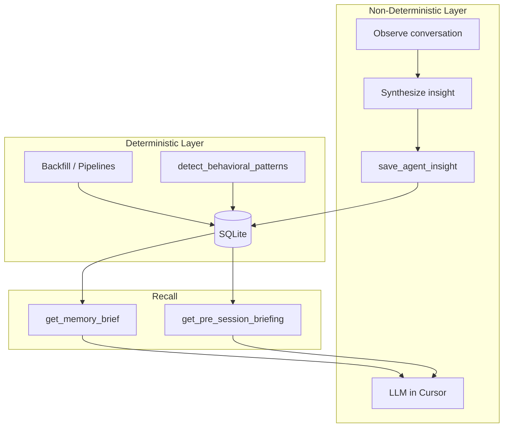

# Cursor Agent Memory Integration (Revised)

## Current State

The memory system exists in [memory.rs](src-tauri/src/memory.rs) and is exposed via MCP in [the-desk-mcp.rs](src-tauri/src/bin/the-desk-mcp.rs). MCP server is working in Cursor.

### Existing MCP Memory Tools


| Tool                         | Purpose                                                                   |
| ---------------------------- | ------------------------------------------------------------------------- |
| `get_memory_brief`           | Ranked memory for session_start, setup_check, trade_review, weekly_review |
| `get_pre_session_briefing`   | Memory brief + account + risk state for session start                     |
| `save_agent_insight`         | Persist LLM-authored insight (candidate/validated lifecycle)              |
| `recall_agent_insights`      | Query stored insights by category, setup, status                          |
| `acknowledge_agent_insight`  | Mark surfaced/helpful/irrelevant/wrong/pin                                |
| `create_memory_followup`     | Create open follow-up for next session                                    |
| `resolve_memory_followup`    | Close follow-up with optional note                                        |
| `detect_behavioral_patterns` | Run deterministic pattern detection                                       |
| `get_behavioral_patterns`    | Query detected patterns                                                   |


### What Already Works

The orchestrator already uses memory in two places:

- **Session start** (RTH + Globex): calls `get_pre_session_briefing` — [orchestrator.md:205](agents/orchestrator.md#L205), [orchestrator.md:234](agents/orchestrator.md#L234)
- **Session review**: calls `get_memory_brief(intent="trade_review")` + `save_agent_insight` + `create_memory_followup` — [orchestrator.md:252-255](agents/orchestrator.md#L252-L255)

### The Gap

1. **AGENT.md** doesn't list Memory as a tool category or map memory tools to agents
2. **No mid-session capture**: The orchestrator has no guidance for proactively saving insights during live conversation — only at session start (read) and session review (write)
3. **No proactive behavior**: The agent waits for explicit "remember this" instead of recognizing save-worthy moments and acting on them
4. **No insight categories for LLM-authored observations**: Categories like `market_observation` and `regime_note` aren't documented for agent use

---

## Architecture: Deterministic vs Non-Deterministic




- **Deterministic:** Behavioral patterns, mistake tags, setup stats — computed from sessions/trades/reviews. Already implemented.
- **Non-deterministic:** The LLM observes market context, trader reflections, regime notes; synthesizes and persists via `save_agent_insight`. Content is LLM-generated; storage and retrieval are deterministic.

---

## Implementation Plan

### 1. Add Memory to AGENT.md Tool Reference

Add a **Memory** row to the "Full Tool List by Category" table:

```
| **Memory** | `get_memory_brief` | Ranked carry-forward memory by intent |
| | `get_pre_session_briefing` | Memory brief + account + risk state |
| | `save_agent_insight` | Persist LLM-authored insight |
| | `recall_agent_insights` | Query insights by category/setup/status |
| | `acknowledge_agent_insight` | Mark insight surfaced/helpful/irrelevant/wrong/pin |
| | `create_memory_followup` | Open follow-up for next session |
| | `resolve_memory_followup` | Close follow-up with optional note |
| | `detect_behavioral_patterns` | Run deterministic pattern detection |
| | `get_behavioral_patterns` | Query detected patterns |
```

Update the **Agent-to-Capability Mapping** table — add memory tools to orchestrator's "Key tools" column.

### 2. Add Proactive Memory Behavior to Orchestrator

This is the main change. Add two things to [orchestrator.md](agents/orchestrator.md):

#### A. New intent class: `memory_capture`

Add to the Intent Classification list:

```
- `memory_capture` — "remember this", "note that", "next session focus on X", or agent-detected save-worthy moment
```

Add to arbitration precedence (low priority — doesn't displace analysis):

```
9. `memory_capture`
```

#### B. New routing section: "Observation Capture (Proactive)"

Place after the Session Review section. Content:

---

**Observation Capture (Proactive)**

The agent proactively saves insights and follow-ups without being asked. Memory capture happens in the background — never delay or replace the primary response to save an insight.

**When to save (agent decides):**


| Trigger                                                                                                                                        | Tool                     | Category             |
| ---------------------------------------------------------------------------------------------------------------------------------------------- | ------------------------ | -------------------- |
| Trader shares a market observation worth recalling ("NQ chopped around VWAP all Asia session", "that level held three times")                  | `save_agent_insight`     | `market_observation` |
| Trader or agent notes a regime/context pattern ("low RVOL sessions keep faking out OR breaks", "trend days after inside days")                 | `save_agent_insight`     | `regime_note`        |
| Trader reflects on behavior, emotional state, or a lesson learned                                                                              | `save_agent_insight`     | `session_context`    |
| Trader says "next session", "tomorrow", "follow up on", or any forward-looking intent                                                          | `create_memory_followup` | —                    |
| Agent recognizes a repeated pattern across the conversation (e.g., trader keeps asking about the same level, or keeps second-guessing entries) | `save_agent_insight`     | `behavioral`         |
| During debrief/review, a setup-specific lesson emerges                                                                                         | `save_agent_insight`     | `playbook`           |


**When NOT to save:**

- Routine market reads with no novel observation
- Repeated information already captured this session
- Vague or trivial remarks

**Evidence structure for LLM-authored insights:**

```json
{
  "conversationSummary": "1-2 sentence summary of what was discussed",
  "sessionId": "if applicable",
  "tradeId": "if applicable"
}
```

The agent already has market context from baseline calls (`get_market_snapshot`, `get_session_context`). No extra calls needed — just include relevant context in the `summary` field of the insight.

**Follow-up lifecycle:**

- Create via `create_memory_followup` when forward-looking intent is detected
- Follow-ups surface automatically in `get_pre_session_briefing` next session
- Resolve via `resolve_memory_followup` when addressed

**Insight lifecycle:**

- New insights start as `candidate` status
- `get_memory_brief` surfaces them ranked by salience
- Trader feedback (helpful/irrelevant/wrong) via `acknowledge_agent_insight` adjusts future ranking
- Insights that prove consistently helpful get promoted to `validated`

---

### What This Does NOT Change

- No new MCP tools
- No changes to `memory.rs` or DB schema
- No Tauri/React UI changes
- No new files — categories and evidence schema live inline in orchestrator.md
- Session start and session review memory behavior stays as-is (already working)
- MCP server config stays as-is (already working)

---

## Files to Modify


| File                                             | Change                                                                                                                              |
| ------------------------------------------------ | ----------------------------------------------------------------------------------------------------------------------------------- |
| [AGENT.md](AGENT.md)                             | Add Memory category to tool list table; add memory tools to orchestrator row in agent-to-capability mapping                         |
| [agents/orchestrator.md](agents/orchestrator.md) | Add `memory_capture` intent class; add "Observation Capture (Proactive)" routing section with categories, triggers, evidence schema |


**Two files. No new files. No Rust changes.**