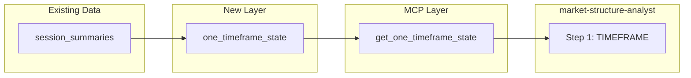

# Higher-Timeframe One-Timeframing (OTF) for Market Structure Analyst

## Current State

The [market-structure-analyst](c:\the-desk\agents\market-structure-analyst.md) agent follows the Dalton decision tree. **Step 1 (TIMEFRAME)** requires classifying Daily, Weekly, and Monthly as one-timeframing up (OTFU), one-timeframing down (OTFD), or BALANCE. The agent explicitly notes:

> **OTF limitation:** Daily/Weekly/Monthly one-timeframing is not directly supported by MCP tools. Infer Daily OTF from `get_session_history` (session highs/lows). Weekly/Monthly OTF requires manual inference or user input.

Today:

- `get_session_history` returns daily `session_summaries` (OHLC, POC, VA, DNVA per RTH session)
- `session_date` is YYYY-MM-DD; rows are one per RTH day
- No aggregation for weekly or monthly bars; no OTF computation

---

## What One-Timeframing Means


| State       | Definition                                   | Invalidation                        |
| ----------- | -------------------------------------------- | ----------------------------------- |
| **OTFU**    | Each bar's low holds above prior bar's low   | Price closes below prior bar's low  |
| **OTFD**    | Each bar's high holds below prior bar's high | Price closes above prior bar's high |
| **BALANCE** | Neither condition (range-bound)              | —                                   |


For weekly: each *week's* low > prior week's low (OTFU) or each week's high < prior week's high (OTFD). Same logic for monthly.

---

## Proposed Architecture

### 1. New MCP Tool: `get_one_timeframe_state`

**Purpose:** Return OTF state (OTFU/OTFD/BALANCE), invalidation level, duration, and recent bars for a given timeframe.

**Parameters:**

- `timeframe` (required): `"daily"` | `"weekly"` | `"monthly"`
- `lookback` (optional): number of bars to include for context (default 12–20)

**Returns:**

```json
{
  "timeframe": "weekly",
  "state": "OTFU",
  "durationBars": 4,
  "invalidationLevel": 20850.25,
  "invalidationDirection": "below",
  "currentBar": { "high": 21200.0, "low": 20900.0, "close": 21150.0, "periodLabel": "2026-W09" },
  "priorBars": [{ "high": ..., "low": ..., "close": ..., "periodLabel": "2026-W08" }, ...],
  "dataSourceNote": "Derived from session_summaries (RTH only)"
}
```

**Computation (on-the-fly from `session_summaries`):**

1. Query `session_summaries` ordered by `session_date` DESC, limit sufficient days (e.g. 250 for weekly, 60 for monthly)
2. **Aggregate by period:**
  - **Weekly:** Group by ISO week (e.g. `strftime('%Y-W%W', session_date)` or manual week logic). Week = Mon–Sun (calendar) or Sun 6pm–Fri 4:15pm (CME trading week). Recommend calendar week for consistency with charting tools.
  - **Monthly:** Group by `session_date[0:7]` (YYYY-MM)
3. For each period: `high = max(daily highs)`, `low = min(daily lows)`, `open = first day open`, `close = last day close`
4. **OTF logic:** Walk periods from most recent backward:
  - OTFU: while `period[i].low > period[i-1].low` → state = OTFU; invalidation = `period[i-1].low`
  - OTFD: while `period[i].high < period[i-1].high` → state = OTFD; invalidation = `period[i-1].high`
  - First violation → BALANCE; record invalidation level
5. Return state, duration, invalidation level, and last N bars

**Placement:** New tool in [the-desk-mcp.rs](c:\the-desk\src\bin\the-desk-mcp.rs); computation in [research](c:\the-desk\src\research) module (Layer 2.5) since it's historical aggregation, not live pipeline.

---

### 2. Week Definition Choice


| Option               | Description           | Pros                                        | Cons                                                        |
| -------------------- | --------------------- | ------------------------------------------- | ----------------------------------------------------------- |
| **Calendar week**    | Mon–Sun               | Matches TradingView/weekly chart convention | Friday close can be "next week" in some systems             |
| **CME trading week** | Sun 6pm–Fri 4:15pm ET | Aligns with futures session boundaries      | More complex; Sunday has no RTH, so "week" mixes Globex+RTH |


**Recommendation:** Calendar week (Mon–Sun). Use `strftime` or chrono `iso_week()` for deterministic grouping. Document in tool description. Can add `weekType` param later if CME week is desired.

---

### 3. Agent Integration

Update [market-structure-analyst.md](c:\the-desk\agents\market-structure-analyst.md):

- **Primary tools:** Add `get_one_timeframe_state` — "Returns OTFU/OTFD/BALANCE with invalidation level for daily, weekly, monthly. Call for weekly and monthly when step 1 (TIMEFRAME) is invoked."
- **Always-do-this-first:** Extend step 1: after `get_session_history`, call `get_one_timeframe_state(timeframe=weekly)` and `get_one_timeframe_state(timeframe=monthly)` to establish higher-timeframe OTF state.
- **Remove:** The "OTF limitation" note from step 1.
- **Output format:** Update "OTF status" line to: `Daily [state] / Weekly [state] / Monthly [state] — invalidation levels: [list when in OTF]`

Daily OTF can still be inferred from `get_session_history` (existing behavior), or we could add `timeframe=daily` to the new tool for consistency.

---

### 4. Implementation Todos


| Task                      | Location                                  | Description                                                                                                             |
| ------------------------- | ----------------------------------------- | ----------------------------------------------------------------------------------------------------------------------- |
| Research module OTF logic | `src/research/mod.rs`           | Add `one_timeframe_state(db, timeframe, lookback)` that aggregates session_summaries, computes OTF                      |
| DB helper                 | `src/db/mod.rs`                 | Optional: `list_session_summaries_for_date_range(&self, start, end)` if not already covered by `list_session_summaries` |
| MCP tool                  | `src/bin/the-desk-mcp.rs`       | Add `get_one_timeframe_state` tool, param struct, wire to research                                                      |
| MCP descriptor            | `mcps/project-0-the-desk-the-desk/tools/` | Add `get_one_timeframe_state.json` for Cursor discovery                                                                 |
| Agent definition          | `agents/market-structure-analyst.md`      | Add tool, update step 1, remove OTF limitation, update output format                                                    |
| Trading-domain skill      | `skills/trading-domain/SKILL.md`          | Optional: Add short OTF subsection if not already present                                                               |
| Tests                     | `src/research/` + `db/`         | Unit tests with known session data (e.g. 5 weeks of synthetic bars)                                                     |


---

### 5. Data Flow Diagram




---

### 6. Edge Cases and Notes

- **Incomplete current period:** For weekly/monthly, the "current" bar may be in progress. Options: (a) exclude current period from OTF (only use completed bars), or (b) include it with a flag `currentBarInProgress: true`. Recommend (a) for deterministic OTF — only completed periods count.
- **Holidays / sparse data:** If a week has no RTH days (holiday week), that "week" has no data. Skip or mark as `noData`. Same for month.
- **Minimum bars:** Require at least 2 completed periods to compute OTF; otherwise return `state: "insufficient_data"`.
- **levels-analyst:** Could also benefit from weekly/monthly OTF for level context. Add to its tool list in a follow-up.

---

### 7. Out of Scope (Future)

- CME trading-week option (Sun–Fri)
- Contract-month aggregation for roll-aware analysis
- Pre-computed `weekly_summaries` / `monthly_summaries` tables (optimization if on-the-fly is slow)
- OTF as a rules-engine condition (e.g. "only fire when weekly OTFU")

