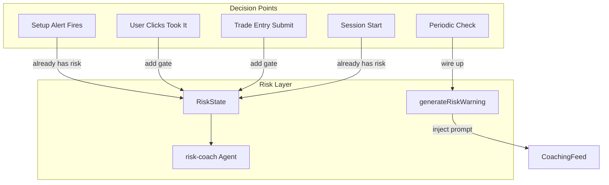

# Risk Manager Integration Plan

## Current State Summary

| Flow                          | Risk Involved?       | Gap                                                  |
| ----------------------------- | -------------------- | ---------------------------------------------------- |
| Setup alert → coaching prompt | Yes (in LLM context) | Risk included in `buildUserMessage`                  |
| Rules engine                  | Yes                  | Suppresses alerts when `at_limit`                    |
| Pre-session briefing          | Yes                  | Risk in synthesis context                            |
| Proactive risk warnings       | No                   | `generateRiskWarning` exists but is **never called** |
| "Took it" / trade entry       | No                   | No risk check; TradeEntryForm has no risk context    |
| Trade management prompts      | Yes                  | Risk in `ManagementContext`                          |
| risk-coach agent              | Manual only          | Invoked by user; not auto-triggered                  |
| RiskBar                       | Yes                  | Shows R only; no dollar display                      |
| Risk config                   | R-based              | No LucidFlex params (e.g. $750 daily limit)          |

---

## Architecture: Risk in Every Decision

---

## Implementation Tasks

### 1. Wire Proactive Risk Warnings

**Problem:** `generateRiskWarning` in [src/lib/claude.ts](src/lib/claude.ts) is never invoked.

**Solution:** Add a `useEffect` in [src/App.tsx](src/App.tsx) that watches `riskState` and, when thresholds are hit, calls `generateRiskWarning` and prepends the result to `localPrompts`. Thresholds:

- `at_limit` → always inject
- `dailyPnlR <= -0.8 * maxDailyLossR` (80% of limit) → inject
- `consecutiveLosses >= 3` → inject

Use a ref or state to debounce/dedupe so we don't spam the same warning every 2 seconds. Emit once per threshold breach until risk state improves.

---

### 2. Pre-Entry Risk Gate ("Took it" Flow)

**Files:** [src/App.tsx](src/App.tsx), [src/components/coaching/coaching-feed.tsx](src/components/coaching/coaching-feed.tsx)

**Solution:**

- Pass `riskState` into `CoachingFeed`.
- When `riskState?.atLimit === true`, disable the "Took it" button and show a short message: "Your daily loss limit has been reached. Your rules say to stop trading for the day."
- Optional: When approaching limit (e.g. 80%), show a warning badge near "Took it" but still allow (e.g. "Approaching limit: -X.XR of -YR. Proceed with caution.").

---

### 3. TradeEntryForm Risk Context

**File:** [src/components/coaching/trade-entry-form.tsx](src/components/coaching/trade-entry-form.tsx)

**Solution:**

- Add optional `riskState` and `riskConfig` props.
- When provided and `atLimit`, disable the submit button and show: "Daily limit reached. Do not log new trades."
- Optionally display "Remaining: X.XR" (e.g. `maxDailyLossR + dailyPnlR`) when negative.

---

### 4. LucidFlex / Prop Account Config

**Files:** [src-tauri/src/db/mod.rs](src-tauri/src/db/mod.rs) (RiskConfigRecord), [src/App.tsx](src/App.tsx) (SettingsPanel), [src/lib/types.ts](src/lib/types.ts)

**Solution:** Extend risk config with optional prop-account fields (backward compatible):

- `maxDailyLossDollars: Option<f64>` (e.g. 750)
- `contractType: Option<String>` (e.g. "MNQ")
- `accountSizeDollars: Option<f64>` (e.g. 50000)

When `maxDailyLossDollars` is set, the UI can show both R and dollars in RiskBar. The R-based logic stays the same; this is for display and validation. Schema: add columns to `risk_config` with migration, or store in `no_trade_zones`-style JSON if preferred to avoid migrations.

**Simpler option:** Add `maxDailyLossDollars` only. Compute from `maxDailyLossR * rValueDollars` for display, or allow override for cases where the user thinks in dollars (e.g. $750) and we derive R as `750 / rValueDollars`.

---

### 5. RiskBar Dollar Display

**File:** [src/components/risk/risk-bar.tsx](src/components/risk/risk-bar.tsx)

**Solution:** When `riskConfig` (or derived values) includes dollar info, show both:

- `-2.5R` and `(~$187 of $750)` when `rValueDollars` and `maxDailyLossDollars` (or `maxDailyLossR * rValueDollars`) are available.

Requires passing `riskConfig` into RiskBar or fetching it in the component.

---

### 6. risk-coach Agent Enhancement

**File:** [agents/risk-coach.md](agents/risk-coach.md)

**Solution:**

- Add LucidFlex/prop account context to the agent instructions: "If the trader has configured prop account parameters (e.g. daily loss $750, MNQ), reference those in your feedback."
- Add `get_risk_config` to the primary tools list.
- Update AGENT.md to document: "When evaluating setups or discussing trade decisions, invoke risk-coach first or ensure get_risk_state is included in your context."

---

### 7. Orchestration Note (Cursor Agents)

The risk-coach agent cannot be auto-invoked by the Tauri app; Cursor agents are user- or agent-triggered. The app-side changes (proactive warnings, pre-entry gates, TradeEntryForm blocks) provide risk involvement without needing agent automation. For agent-side coverage:

- Document in [AGENT.md](AGENT.md) that agents evaluating trades should call `get_risk_state` (or spawn risk-coach) before responding.
- Ensure `get_setup_context` and `get_risk_state` remain in MCP so any agent can fetch risk when needed.

---

## File Change Summary

| File                                                                                         | Change                                                                                                    |
| -------------------------------------------------------------------------------------------- | --------------------------------------------------------------------------------------------------------- |
| [src/App.tsx](src/App.tsx)                                                                   | Add useEffect for proactive risk warnings; pass riskState to CoachingFeed; optional riskConfig to RiskBar |
| [src/components/coaching/coaching-feed.tsx](src/components/coaching/coaching-feed.tsx)       | Accept riskState; gate "Took it" when atLimit; pass riskState to TradeEntryForm                           |
| [src/components/coaching/trade-entry-form.tsx](src/components/coaching/trade-entry-form.tsx) | Accept riskState; disable submit when atLimit; show remaining R when near limit                           |
| [src/components/risk/risk-bar.tsx](src/components/risk/risk-bar.tsx)                         | Add dollar display when riskConfig available                                                              |
| [src/lib/claude.ts](src/lib/claude.ts)                                                       | No change (generateRiskWarning already exists)                                                            |
| [src-tauri/src/db/mod.rs](src-tauri/src/db/mod.rs)                                           | Optional: add max_daily_loss_dollars to RiskConfigRecord                                                  |
| [agents/risk-coach.md](agents/risk-coach.md)                                                 | Add get_risk_config, LucidFlex context                                                                    |
| [AGENT.md](AGENT.md)                                                                         | Add risk-coach invocation guidance for trade decisions                                                    |

---

## Out of Scope / Deferred

- Deterministic `get_risk_guardrail` MCP tool (can add later if useful).
- Full prop account config UI (account size, contract type) — can start with `maxDailyLossDollars` only.
- Automatic risk-coach agent invocation (requires Cursor orchestration features beyond current repo).

