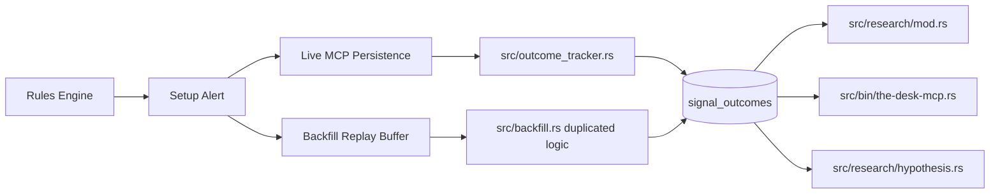

# Signal Outcome Integrity Plan

## Implementation Status
Implemented on 2026-05-04.

Completed:
- Verified outcome contract in `src/outcomes.rs`.
- Schema v29 for auditable outcome metadata and deterministic legacy duration/exit-price repair.
- Shared live/backfill/manual outcome writer path.
- Dedicated `validate_signal_outcome_integrity` MCP tool and compact `validate_data_integrity()` summary.
- Source/job/quality filters plus read-time R recomputation across performance, hypothesis, and research readers.
- Regression coverage for narrative-template exclusion, read-time R override, manual bridge resolution, live/engine equivalence, and golden replay.

Remaining:
- Rerun backtests with fresh `job_id`s under the new engine.
- Establish a verified IDEA-011 baseline.
- After verified reruns exist for the target windows, flip transition defaults from `includeUnverified=true` to verified-only.

## Goal
Make `signal_outcomes` trustworthy enough that IDEA-011 and later regime-gated setup backtests can be treated as real evidence. The destination is not just fixing existing rows; it is preventing bad outcome rows from entering research again.

## Current Data Flow

Important files:
- [src/outcome_tracker.rs](src/outcome_tracker.rs): live tick MFE/MAE and resolution.
- [src/backfill.rs](src/backfill.rs): historical replay creates and resolves backtest outcomes with duplicated logic.
- [src/db/mod.rs](src/db/mod.rs): schema, insert/resolve/query helpers, performance matrix.
- [src/research/mod.rs](src/research/mod.rs): distribution, conditional, excursion queries.
- [src/research/hypothesis.rs](src/research/hypothesis.rs): hypothesis summary and promotion gate.
- [src/rules/mod.rs](src/rules/mod.rs): target/stop resolution included in setup alerts.
- [tests/session_replay_golden.rs](tests/session_replay_golden.rs): golden replay already compares outcome payloads, but needs stronger semantic fixtures.

## What Looks Broken Or Missing
- `resolve_signal_outcome()` stores `time_to_outcome_ms = outcome_at_ms` instead of `outcome_at_ms - fired_at_ms` for the live path.
- Live and backtest outcome math are duplicated, so they can drift.
- Backtest `r_result` uses global `risk_config.r_value_points`; hypothesis setups can define their own `position_sizing.r_points`, so R results can be materially wrong.
- Direction is inferred from target/stop each tick. If target/stop are missing or unresolved, pending outcomes can finalize as if they were short.
- Many playbook templates have narrative target/stop JSON that is not numerically resolvable by `resolve_price_expression()`. Those are useful alerts but not valid backtestable outcomes yet.
- Research queries generally read `outcome != 'pending'` and do not require source/job/quality isolation, so live, backfill, multiple backtest runs, and legacy rows can be mixed.
- `winRate` is often `target_hit / resolved`, which can misclassify positive time exits and hides malformed target-hit rows.
- `validate_data_integrity()` checks feed/pipeline integrity, but not signal outcome integrity.
- Existing golden tests catch JSON drift, not semantic invariants like sane stop direction, valid R basis, or non-bogus time exits.

## Implementation Strategy
### 1. Define A Verified Outcome Contract
Create a small, explicit contract in code before changing storage behavior. A verified setup outcome must have:
- `direction`: long or short, captured at fire time and never inferred as a fallback during resolution.
- `entry_price`, `target_price`, `stop_price`, and `risk_points > 0`, all captured at fire time for automated target/stop outcome evaluation.
- `source` and, for backtests, `job_id`.
- `exit_price` for every resolved row, including `time_exit`.
- `fired_at_ms <= outcome_at_ms` and `time_to_outcome_ms = outcome_at_ms - fired_at_ms`.
- nonnegative MFE/MAE in points, updated from tick order after signal fire.
- `risk_points = first_finite_positive(abs(entry_price - stop_price), setup.position_sizing.r_points)`.
- no silent fallback to `risk_config.r_value_points`; if no finite positive setup risk basis exists, the row is `notBacktestable` and `r_result` stays `NULL`.
- strict verified-exit rule: `stop_price` is required for `verified`. A setup with `position_sizing.r_points` but no numeric stop is still `notBacktestable` for automated setup statistics and should carry a `noNumericStop` quality flag until the template adds a numeric stop expression.
- `r_result = signed_points / risk_points`, recomputable from stored `direction`, `entry_price`, `exit_price`, and `risk_points`.
- a quality status: `verified`, `notBacktestable`, `legacyUnverified`, or `invalid`.
- an engine identity tuple: `outcome_engine_version`, `rules_schema_version`, and `setup_template_hash`.

`setup_template_hash` must be stable across formatting-only edits: SHA-256 over canonical JSON containing only `conditions`, `entry_logic`, `stop_logic`, `targets`, `position_sizing`, and `min_delta`. Exclude `name`, `description`, `template_source`, and other human-facing fields. Canonical JSON means sorted object keys and no insignificant whitespace.

### 2. Build One Outcome Engine
Refactor outcome logic into one pure module, likely by expanding [src/outcome_tracker.rs](src/outcome_tracker.rs) or introducing `src/outcomes.rs`:
- `ResolvedSignalSpec`: signal id, setup id, direction, entry, target, stop, risk points, source/job, setup template hash.
- `OutcomeState`: pending row plus MFE/MAE.
- `apply_tick_to_outcome()`: deterministic target/stop/MFE/MAE update.
- `finalize_time_exit()`: uses the last valid tick in the same session, never the first tick of the next session.
- `validate_outcome_row()`: returns quality flags and an integrity status.

Then call the same engine from:
- live MCP tick processing in [src/bin/the-desk-mcp.rs](src/bin/the-desk-mcp.rs),
- historical replay in [src/backfill.rs](src/backfill.rs),
- any manual trade bridge in [src/db/mod.rs](src/db/mod.rs).

The live time-exit rule must be explicit: either finalize from a session-close event using that close, or, when the first next-session tick is observed, finalize the old pending row using tracked `last_in_session_price` and `last_in_session_timestamp_ms`. Do not price a time exit from the next session's first tick.

### 3. Make Non-Backtestable Alerts Explicit
When a setup alert does not resolve to numeric direction/target/stop/risk:
- still persist `playbook_signals` for lifecycle/review,
- do not let it enter verified setup performance,
- either skip `signal_outcomes` or insert it as `notBacktestable` with explanatory quality flags.

This prevents narrative templates from creating bogus `time_exit` rows.

### 4. Add Schema Support For Auditable Outcomes
Add a migration in [src/db/mod.rs](src/db/mod.rs) for fields such as:
- `direction TEXT`,
- `entry_price REAL`,
- `risk_points REAL`,
- `exit_price REAL`,
- `outcome_quality TEXT NOT NULL DEFAULT 'legacyUnverified'`,
- `quality_flags TEXT`,
- `outcome_engine_version TEXT`,
- `rules_schema_version TEXT`,
- `setup_template_hash TEXT`.

Existing rows should not be silently trusted. Mark them `legacyUnverified` unless the validator can prove them safe. One deterministic repair is safe during migration: if `outcome_at_ms` and `fired_at_ms` are present and sane, set `time_to_outcome_ms = outcome_at_ms - fired_at_ms`. Rows whose direction, exit price, or risk basis cannot be proven remain unverified even if duration is repaired.

### 5. Add Outcome Integrity Reporting
Add a DB-level integrity report, then expose it through a dedicated MCP tool such as `validate_signal_outcome_integrity({ source, jobId, setupId? })`. Include a compact summary inside `validate_data_integrity()`, but keep the outcome-specific report separately callable by research agents.

The report should include:
- counts by `source`, `job_id`, setup, quality, and outcome,
- rows with bad `time_to_outcome_ms`, missing direction, missing risk, impossible R sign, invalid target/stop geometry, missing session summary joins, unresolved numeric exits, and mixed source/job queries,
- clear `ok | warning | failed` status.
- numeric thresholds so warnings do not become background noise. Starter default: `legacyUnverifiedRatioWarn = 0.05` per setup per research window. Examples: `failed` if any verified backtest row has impossible R sign versus outcome geometry, any resolved row lacks `exit_price`, or any verified row has invalid elapsed time; `warning` if `legacyUnverified` exceeds the configured ratio in a requested research window.

Backtest runs should store this report in `backtest_runs.metrics` so `get_backtest_results` shows whether a run is trustworthy.

### 6. Harden Research Queries
Update research and performance readers so verified evidence becomes the default after at least one verified rerun cycle exists:
- Add source/job/quality filters to `query_signal_outcome_distribution`, `query_signal_outcome_conditional`, `query_signal_outcome_excursions`, `get_setup_performance_matrix`, `get_signal_performance`, context frame setup outcomes, and trader memory opportunity context.
- Default backtest-oriented tools to `source='backtest'` when a `jobId` is supplied.
- During the transition, default `includeUnverified = true` only where needed to preserve existing studies, but emit loud metadata notes and excluded/legacy counts. Flip the default to verified-only after fresh backtests exist for the target study window.
- Exclude `legacyUnverified`, `invalid`, and `notBacktestable` rows unless an explicit `includeUnverified` flag is set after the transition.
- Research metadata must split returned and excluded rows by quality, for example `{ verified: N, legacyUnverified: M, notBacktestable: K, invalid: J }`, so agents can distinguish newly verified datasets from legacy-heavy ones.
- If `includeUnverified=false` and no verified rows exist for a requested `jobId` / setup / window, return an explicit `noVerifiedRows` status with an actionable hint to rerun the backtest with the current outcome engine; do not silently return an empty statistic.
- Recompute signed R from stored `direction`, `entry_price`, `exit_price`, and `risk_points` in summaries/queries when those fields are available; do not treat writer-populated `r_result` as the sole source of truth.
- Change win-rate logic to prefer recomputed `r_result > 0`; report `targetHitRate`, `stopHitRate`, and `timeExitRate` separately.
- Put excluded-row counts and quality notes in research metadata.

### 7. Repair Existing Data Safely
Do not try to magically rewrite all historical outcomes in place, but do recover fields that are deterministic without tick replay.
- First run the new integrity report against the current database.
- Repair `time_to_outcome_ms` where `outcome_at_ms - fired_at_ms` is available and nonnegative.
- Recover `exit_price` only where deterministic without replay: `target_hit` can use `target_price`, `stop_hit` can use `stop_price`; `time_exit` needs tick replay unless a reliable exit price was already stored.
- Recompute direction/risk/R only for rows whose stored entry, target, stop, exit, and setup risk basis are provably sufficient; keep all others `legacyUnverified`.
- Mark unverifiable historical rows as `legacyUnverified`.
- Re-run backtests with the new engine and a fresh `job_id`; use the new verified run for IDEA-011.
- Preserve live/manual rows, but tag their provenance and quality honestly.
- If a past backtest row can be recomputed exactly from stored job params and source SCID, prefer recomputation over mutation.

### 8. Test The Contract, Not Just The JSON
Add targeted tests:
- Unit tests for long/short target hit, stop hit, time exit, MFE/MAE, and R calculation.
- Regression for live `time_to_outcome_ms`.
- Narrative-template guard: fire a setup with unresolved `stop_logic` such as `{"type":"below_value_area"}`, replay ticks across the fire price both ways, and assert no `verified` outcome is produced.
- Live/backfill engine equivalence: run the same fixture ticks through live outcome resolution and historical replay resolution, and assert equal outcome rows modulo `source`/`job_id`.
- Backfill golden with a semantically valid fixed-point setup: target, stop, direction, risk points, and expected R.
- Research query tests proving source/job/quality filters prevent mixing live/backtest/legacy rows.
- Read-time R recomputation override: seed a row whose stored `r_result` disagrees with `direction`/`entry_price`/`exit_price`/`risk_points`, assert readers use the recomputed value and surface both stored and recomputed values in metadata.
- Transition failure guard: with `includeUnverified=false` and a `jobId` that has no verified rerun, assert the query returns `noVerifiedRows` with a rerun hint rather than a silent empty array.
- Quality-count metadata test: during the transition path, assert returned metadata splits rows by `verified`, `legacyUnverified`, `notBacktestable`, and `invalid`.
- Hypothesis summary test proving `position_sizing.r_points` or stop distance drives R, not global risk config.
- Manual trade bridge test proving `record_trade_result` / `resolve_pending_signal_by_setup_id` produces sane elapsed time, exit price, and quality metadata.
- Private real-SCID replay after the synthetic tests pass.

## What Not To Overlook
- RTH/Globex scope: time exits must finalize inside the correct session, not on the next session's first tick.
- Source isolation: backtest rows should not mix with live rows in performance metrics.
- Setup definitions: a setup can be valid for live coaching but invalid for automated backtesting until exits are numeric.
- R basis: R must be per setup/backtest definition, not accidentally inherited from current account risk config, for live and backtest rows alike.
- Engine versioning: every verified backtest should be traceable to the outcome engine version, rules schema, and setup template hash.
- Manual trade bridging: this is a third writer path and must not keep the old `resolve_signal_outcome()` semantics.
- Transition sequencing: do not flip research queries to verified-only until verified reruns exist for the immediate research window.
- Existing caveats: poor-high/poor-low and `single_prints_direction` still matter for regime slicing, but they are a separate instrumentation pass unless the immediate query depends on them.

## Success Criteria
- New backtest outcome rows are either `verified` or explicitly excluded with a reason.
- `time_to_outcome_ms`, MFE, MAE, and R results are deterministic and covered by tests.
- Research tools report effective sample size from verified rows and warn about excluded legacy/invalid rows.
- `get_backtest_results` and hypothesis summaries show outcome integrity status.
- IDEA-011 can be run without relying on the previously broken `signal_outcomes` population.