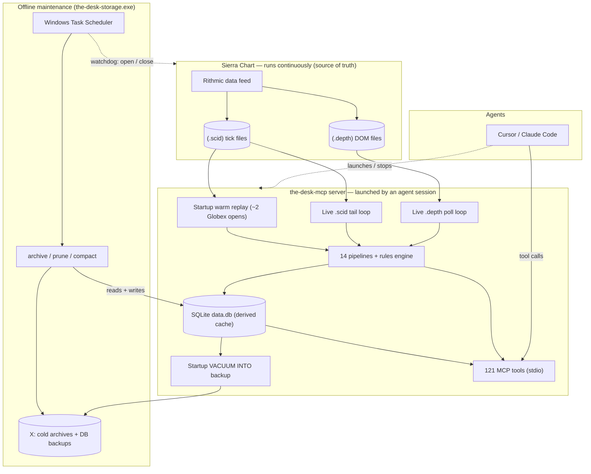

# The Desk — System Data Flow

How Sierra Chart, the MCP server, agents (Cursor / Claude Code), and the offline
maintenance tooling fit together: who writes what, who reads what, and which tool
performs which task. Read this with [the ops runbook](../ops/automation-and-storage.md)
(scheduled tasks, storage reclaim) and [the MCP architecture](../mcp/README.md).

## The one-paragraph model

**Sierra Chart is the recorder. The MCP server is the reader/brain. Agents are the
clients. `the-desk-storage` is the janitor.** Sierra continuously writes tick (`.scid`)
and DOM (`.depth`) files — those are the durable source of truth. The MCP server *tails*
those files into a derived SQLite cache (`data.db`), runs the pipelines + rules engine,
and exposes 121 read tools over stdio. Agents call those tools. A separate maintenance
binary (`the-desk-storage.exe`), driven by Windows Task Scheduler, archives/prunes/compacts
the SQLite cache. The MCP server **never** prunes or archives; it only ingests.

## Component & data-flow diagram

## Who owns what

| Actor | Binary / process | Writes | Reads | Never does |
| --- | --- | --- | --- | --- |
| **Recorder** | Sierra Chart (`SierraChart_64.exe`) | `.scid`, `.depth` on T: | — | Touch `data.db` |
| **Reader / brain** | `the-desk-mcp.exe` | `data.db` (ingest), `backups/*.db` (startup snapshot) | `.scid`, `.depth`, `data.db` | Archive / prune / alter Sierra files |
| **Client** | Cursor / Claude Code | — (calls tools) | via MCP tools | Touch files directly |
| **Janitor** | `the-desk-storage.exe` (+ Task Scheduler) | `data.db` (delete/compact), cold archives on X: | `data.db` | Run while the MCP server is up (it aborts) |

**Lock rule:** `data.db` has one writer at a time. The MCP server is that writer while it
runs. `the-desk-storage` opens the same file, so **the server must be stopped for any
archive / prune / compact / swap** — the scheduled archive task aborts if it sees
`the-desk-mcp` running. Sierra never locks `data.db`, so it can keep recording during DB
maintenance.

## What MCP server startup triggers

On launch (`src/bin/the-desk-mcp/main.rs`), in background tasks (off the stdio path):

1. **Runtime-event pruning** — housekeeping of the `runtime_events` log.
2. **Prior-day level load** — so tools return correct levels before backfill finishes.
3. **Startup `VACUUM INTO` backup** (`[backup]`) — a ~DB-sized snapshot. On a near-full
   drive this can fill the disk; route it to X: and see
   [the backup hazard note](../ops/automation-and-storage.md#database-backups--disk-fill-hazard).
4. **Warm-replay backfill** — replays ~2 Globex opens of `.scid` through the pipelines to
   rebuild live market state (`run_startup_warm_replay`).
5. **Live ingestion begins:**
   - `.scid` tail loop → `raw_ticks`, `market_events`, periodic feature snapshots, rules
     analysis passes, and session-boundary finalization (RTH close → `session_summaries`,
     `prior_day_levels`).
   - `.depth` poll loop → `depth_events` (DOM). *This is the table that grows fastest;*
     bound it with `depth_retention_days` (see the runbook).
   - A stall watchdog + boundary-cache prewarm.

**It does NOT archive, prune, or compact anything** — that is exclusively
`the-desk-storage`. **Shutdown** has no hook: it simply stops ingestion. Because Sierra
keeps writing the source files, the next startup's warm replay (and `backfill_history` for
larger gaps) reconstructs whatever the DB missed.

## What `the-desk-storage.exe` does (the janitor)

Run outside market hours, with the MCP server stopped:

| Command | Effect |
| --- | --- |
| `--status` | Report raw-tick + depth coverage and storage settings (read-only; fast). |
| `--maintain [--cutoff DATE]` | Archive `raw_ticks` older than `warm_retention_days` to zstd cold storage **and** prune `depth_events` older than `depth_retention_days`. Used by the weekly task. |
| `--prune-depth [--depth-cutoff DATE]` | Just the depth prune (chunked, WAL-bounded). |
| `--compact-into PATH` | `VACUUM INTO` a compacted copy (the only step that shrinks the file) + verify it. |
| `--vacuum` | In-place compaction (needs ~DB-size free; avoid on a near-full drive — use `--compact-into` to a roomy drive instead). |

## Can the MCP server be automated on/off?

**Today:** the server is an MCP **stdio** service — it expects an agent client on stdin.
The background ingestion loops are spawned before `serve(stdio())`, but when stdin reaches
EOF (no client) `serve()` returns and the process exits, killing the loops. So it **cannot
run truly headless** as-is; it comes up when an editor/agent session launches it and goes
down when that session ends. (Note: that launcher is *any* active Cursor **or** Claude Code
session, not only Cursor — so the server can reappear whenever a session engages.)

**Recommendation — you generally do *not* want it always-on:**
- It is the `data.db` writer, so an always-on server would **block** the weekly
  archive/prune/compact (those need exclusive access).
- The `.scid`/`.depth` files are the source of truth, so intermittent ingestion is fully
  recoverable: startup warm replay + `backfill_history` rebuild any gap. Missing some live
  DB ingestion costs nothing permanent.

So the simplest robust pattern is the current one: **let agents launch it on demand, and
run maintenance when it's down** (the tasks already abort if it's up).

**If continuous DB ingestion is genuinely wanted** (e.g. always-fresh research tables
without a manual backfill), the clean path is a small feature: an `--ingest-only` headless
mode that runs the tail/depth loops without `serve(stdio())`, plus a coordination so the
weekly maintenance task stops it, runs, and restarts it. That's a deliberate enhancement,
not a config toggle — flagged here so it's a conscious choice rather than an accident.
