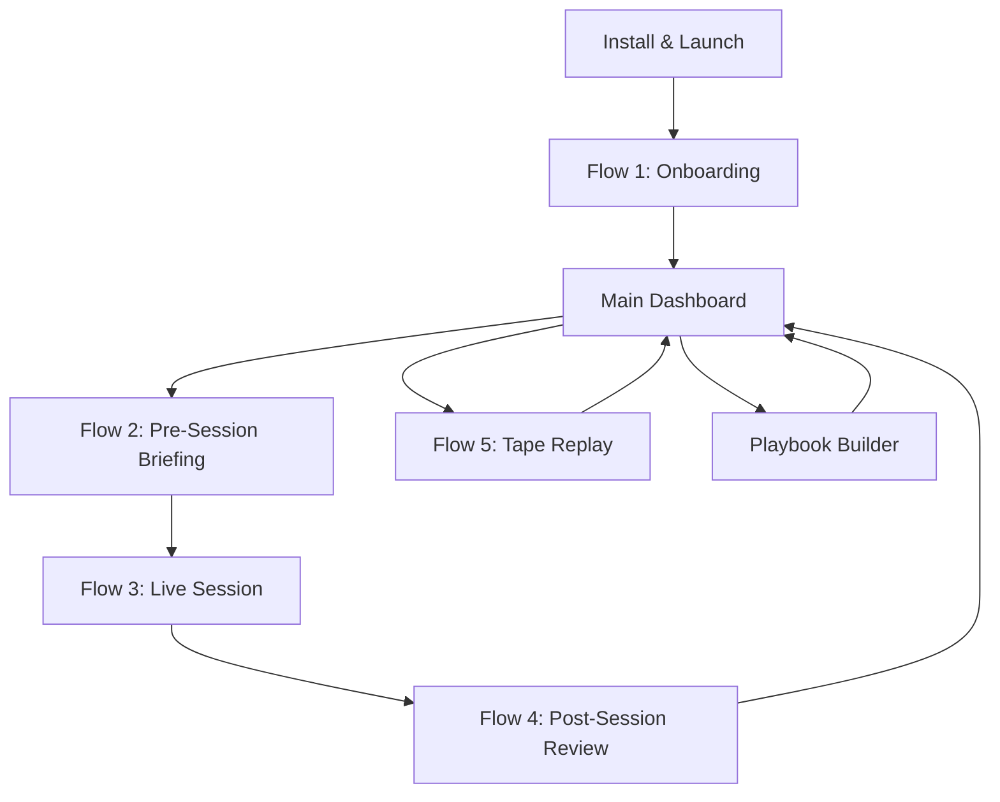

# Core Flows — The Desk

## Overview

This spec defines the 5 primary user flows in The Desk. All flows are designed for a trader working alone at a desk with two monitors — Sierra Chart on the left, The Desk on the right. Interaction is keyboard-first; the trader's hands should rarely leave their execution platform.

**Key decisions baked into these flows:**
- Onboarding setup definition is **optional** — trader can go live with no active setups (prompted but not blocked)
- Trade tracking supports **both** real-time manual entry and post-session CSV import; management prompts adapt accordingly
- Coaching prompts are **actionable** — "Took it / Watching / Passed" — responses are logged for plan adherence tracking

---

## Flow Map



---

## Flow 1: First-Time Onboarding & DTC Setup

**Trigger:** User launches The Desk for the first time.

**Steps:**

1. **Welcome screen** — one-sentence description of what The Desk does. "The Desk watches the market alongside you and helps you execute your own plan." Single CTA: "Get Started."

2. **Step 2 of 4 — Connect to Sierra Chart.** Trader enters the DTC server address (default: `localhost:11099`) and symbol (default: `NQ`). "Test Connection" button validates the connection and shows live status (connected, last trade price, feed name). If connection fails, inline troubleshooting tips appear (is SC running? Is the DTC server enabled in SC settings?). Trader cannot proceed to Step 3 without a successful connection.

3. **Step 3 of 4 — Risk Settings.** Trader defines their 1R value (NQ points and dollar equivalent), max daily loss (R), max consecutive losses before mandatory pause, and max trades per session. Pre-filled with sensible defaults (3R max loss, 3 consecutive losses). All fields editable later in Settings.

4. **Step 4 of 4 — Playbook Setup (optional).** "Define your first setup" opens the LLM-assisted playbook builder. Alternatively, "Skip for now — I'll add setups later" bypasses this step. If skipped, a persistent banner appears on the main dashboard: *"No active setups — The Desk is watching but won't alert on setups. Add a setup to unlock coaching."*

5. **Ready state.** Main dashboard appears. If DTC is connected, live market state populates immediately. If no setups are active, the banner is visible but the trader can use the app fully (market state, risk tracking, notes).

**Exit:** Main dashboard.

```wireframe
<!DOCTYPE html>
<html>
<head>
<style>
  body { background: #0f0f0f; color: #e0e0e0; font-family: monospace; margin: 0; padding: 0; font-size: 13px; display: flex; align-items: center; justify-content: center; min-height: 100vh; }
  .onboarding { width: 480px; }
  .step-indicator { display: flex; gap: 8px; margin-bottom: 32px; align-items: center; }
  .step { width: 24px; height: 24px; border-radius: 50%; display: flex; align-items: center; justify-content: center; font-size: 11px; flex-shrink: 0; }
  .step.done { background: #4caf50; color: #000; }
  .step.active { background: #2196f3; color: #fff; }
  .step.pending { background: #222; color: #555; border: 1px solid #333; }
  .step-line { flex: 1; height: 1px; background: #333; }
  .step-line.done { background: #4caf50; }
  .title { font-size: 20px; font-weight: bold; margin-bottom: 6px; }
  .subtitle { font-size: 13px; color: #888; margin-bottom: 28px; line-height: 1.5; }
  .field { margin-bottom: 16px; }
  .label { font-size: 11px; color: #888; text-transform: uppercase; letter-spacing: 0.5px; margin-bottom: 6px; }
  .input-row { display: flex; gap: 8px; }
  input[type=text] { background: #1a1a1a; border: 1px solid #333; color: #e0e0e0; padding: 8px 12px; font-family: monospace; font-size: 13px; border-radius: 3px; width: 100%; box-sizing: border-box; }
  input.short { width: 80px; flex-shrink: 0; }
  .status-box { background: #1b3a1b; border: 1px solid #2d4a2d; border-radius: 4px; padding: 10px 14px; margin-top: 12px; font-size: 12px; color: #4caf50; display: flex; align-items: center; gap: 8px; }
  .status-dot { width: 8px; height: 8px; border-radius: 50%; background: #4caf50; flex-shrink: 0; }
  .actions { display: flex; justify-content: space-between; align-items: center; margin-top: 28px; }
  .btn-primary { background: #2196f3; border: none; color: #fff; padding: 10px 24px; font-family: monospace; font-size: 13px; border-radius: 3px; cursor: pointer; }
  .btn-secondary { background: transparent; border: 1px solid #333; color: #888; padding: 10px 24px; font-family: monospace; font-size: 13px; border-radius: 3px; cursor: pointer; }
  .hint { font-size: 11px; color: #555; margin-top: 6px; }
</style>
</head>
<body>
  <div class="onboarding">
    <div class="step-indicator">
      <div class="step done">✓</div>
      <div class="step-line done"></div>
      <div class="step active">2</div>
      <div class="step-line"></div>
      <div class="step pending">3</div>
      <div class="step-line"></div>
      <div class="step pending">4</div>
    </div>
    <div class="title">Connect to Sierra Chart</div>
    <div class="subtitle">The Desk connects to Sierra Chart's DTC server to receive live NQ market data. Sierra Chart must be running with the DTC server enabled in Global Settings.</div>
    <div class="field">
      <div class="label">DTC Server Address</div>
      <div class="input-row">
        <input type="text" value="localhost" placeholder="IP address" data-element-id="dtc-host" />
        <input type="text" value="11099" class="short" placeholder="Port" data-element-id="dtc-port" />
      </div>
      <div class="hint">Default: localhost:11099 — change only if Sierra Chart is on a different machine</div>
    </div>
    <div class="field">
      <div class="label">Symbol</div>
      <input type="text" value="NQ" placeholder="e.g. NQ or NQH26" data-element-id="dtc-symbol" />
      <div class="hint">Use the symbol as it appears in Sierra Chart's Find Symbol dialog</div>
    </div>
    <div class="status-box" data-element-id="connection-status">
      <div class="status-dot"></div>
      Connected · NQ · Last trade: 21,432.50 · Feed: Rithmic
    </div>
    <div class="actions">
      <button class="btn-secondary" data-element-id="btn-test">Test Connection</button>
      <button class="btn-primary" data-element-id="btn-next">Next: Risk Settings →</button>
    </div>
  </div>
</body>
</html>
```

---

## Flow 2: Pre-Session Briefing

**Trigger:** Auto-generated at a configurable time (default: 15 minutes before RTH open, 9:15 ET). Trader can also trigger it manually from the main dashboard at any time.

**Steps:**

1. **Briefing panel** replaces the coaching feed area. Header shows date, generation time, and time until RTH open.

2. **Key Levels section** — grid of prior day H/L/C, overnight H/L, prior VA/POC/VAL, prior DNVA/DNP. Text and numbers only — no charts.

3. **Setups in Play section** — each active setup is listed with a likelihood tag (Likely / Possible) and a 1–2 sentence explanation of why it's in play given current context. Backtest metrics shown inline.

4. **Relevant Journal Notes section** — up to 3 past journal entries surfaced from similar market contexts (similar overnight range, similar setup conditions). Date and brief excerpt shown.

5. **Your Note for Today** — free-text input. Trader can write their intention for the session ("focusing on DNVA reversion only, avoiding first 15 min"). Saved with the session record.

6. **"Start Session" button** — transitions to the live session view. Alternatively, the view auto-transitions at RTH open if the trader hasn't clicked.

**Exit:** Live session view.

```wireframe
<!DOCTYPE html>
<html>
<head>
<style>
  body { background: #0f0f0f; color: #e0e0e0; font-family: monospace; margin: 0; padding: 0; font-size: 13px; }
  .header { background: #1a1a1a; border-bottom: 1px solid #333; padding: 12px 20px; display: flex; justify-content: space-between; align-items: center; }
  .header-title { font-size: 15px; font-weight: bold; }
  .header-sub { font-size: 11px; color: #888; margin-top: 2px; }
  .content { padding: 16px 20px; overflow-y: auto; }
  .section { margin-bottom: 20px; }
  .section-title { font-size: 10px; color: #666; text-transform: uppercase; letter-spacing: 0.5px; margin-bottom: 10px; border-bottom: 1px solid #1e1e1e; padding-bottom: 5px; }
  .level-grid { display: grid; grid-template-columns: repeat(3, 1fr); gap: 6px; }
  .level-card { background: #1a1a1a; border: 1px solid #222; border-radius: 3px; padding: 7px 10px; }
  .level-card-label { font-size: 10px; color: #555; }
  .level-card-value { font-size: 14px; font-weight: bold; margin-top: 2px; }
  .setup-card { background: #1a1e2a; border: 1px solid #2d3a4a; border-left: 3px solid #2196f3; border-radius: 3px; padding: 10px 12px; margin-bottom: 8px; }
  .setup-card-name { font-size: 12px; font-weight: bold; color: #2196f3; margin-bottom: 4px; }
  .tag { font-size: 10px; padding: 1px 5px; border-radius: 2px; margin-left: 6px; }
  .tag-likely { background: #1b3a1b; color: #4caf50; }
  .tag-possible { background: #1a2a3a; color: #64b5f6; }
  .setup-card-text { font-size: 12px; color: #aaa; line-height: 1.5; }
  .setup-card-metrics { font-size: 11px; color: #555; margin-top: 5px; }
  .journal-note { background: #1a1a1a; border-left: 3px solid #ff9800; padding: 8px 12px; margin-bottom: 6px; }
  .journal-date { font-size: 10px; color: #555; margin-bottom: 3px; }
  .journal-text { font-size: 12px; color: #aaa; line-height: 1.5; }
  .note-input { width: 100%; background: #1a1a1a; border: 1px solid #333; color: #e0e0e0; padding: 8px 12px; font-family: monospace; font-size: 12px; border-radius: 3px; box-sizing: border-box; }
  .actions { display: flex; gap: 10px; margin-top: 20px; padding-bottom: 16px; }
  .btn-primary { background: #2196f3; border: none; color: #fff; padding: 10px 28px; font-family: monospace; font-size: 13px; border-radius: 3px; cursor: pointer; }
  .btn-secondary { background: transparent; border: 1px solid #333; color: #888; padding: 10px 20px; font-family: monospace; font-size: 13px; border-radius: 3px; cursor: pointer; }
</style>
</head>
<body>
  <div class="header">
    <div>
      <div class="header-title">Pre-Session Briefing</div>
      <div class="header-sub">Thursday, Feb 20 · Generated 09:15 ET · RTH opens in 15 min</div>
    </div>
    <div style="font-size: 11px; color: #4caf50;">● NQ · Rithmic Connected</div>
  </div>
  <div class="content">
    <div class="section">
      <div class="section-title">Key Levels Today</div>
      <div class="level-grid">
        <div class="level-card"><div class="level-card-label">Prior Day High</div><div class="level-card-value">21,512.00</div></div>
        <div class="level-card"><div class="level-card-label">Prior Day Close</div><div class="level-card-value">21,447.25</div></div>
        <div class="level-card"><div class="level-card-label">Prior Day Low</div><div class="level-card-value">21,388.00</div></div>
        <div class="level-card"><div class="level-card-label">Overnight High</div><div class="level-card-value">21,445.00</div></div>
        <div class="level-card"><div class="level-card-label">Overnight Low</div><div class="level-card-value">21,398.50</div></div>
        <div class="level-card"><div class="level-card-label">Prior VA High</div><div class="level-card-value">21,468.00</div></div>
        <div class="level-card"><div class="level-card-label">Prior POC</div><div class="level-card-value">21,452.00</div></div>
        <div class="level-card"><div class="level-card-label">Prior VA Low</div><div class="level-card-value">21,418.00</div></div>
        <div class="level-card"><div class="level-card-label">Prior DNVA Low</div><div class="level-card-value">21,428.00</div></div>
      </div>
    </div>
    <div class="section">
      <div class="section-title">Setups in Play</div>
      <div class="setup-card">
        <div class="setup-card-name">DNVA Reversion <span class="tag tag-likely">Likely</span></div>
        <div class="setup-card-text">Overnight range is tight and price is sitting just below the prior DNVA low (21,428). If RTH opens and rotates back into the DNVA, this setup is in play immediately. Watch for a rebid at the boundary.</div>
        <div class="setup-card-metrics">WR: 64% · Avg R: 1.8R · 47 samples</div>
      </div>
      <div class="setup-card">
        <div class="setup-card-name">Single Print Retest <span class="tag tag-possible">Possible</span></div>
        <div class="setup-card-text">Yesterday's IB left single prints at 21,415–21,420. If price trades down to that zone during RTH, watch for absorption or initiative activity at the level.</div>
        <div class="setup-card-metrics">WR: 58% · Avg R: 1.4R · 31 samples</div>
      </div>
    </div>
    <div class="section">
      <div class="section-title">Relevant Journal Notes</div>
      <div class="journal-note">
        <div class="journal-date">Feb 13 — Similar overnight range, DNVA below close</div>
        <div class="journal-text">Took the DNVA reversion at the open and it worked cleanly. The setup works best when session delta is positive from the start. Don't force it if delta is negative early.</div>
      </div>
      <div class="journal-note">
        <div class="journal-date">Feb 6 — Tight overnight, low-range open</div>
        <div class="journal-text">Overtraded in the first hour. Forced 3 entries before the market picked a direction. Wait for the OR to complete before committing to a bias.</div>
      </div>
    </div>
    <div class="section">
      <div class="section-title">Your Note for Today</div>
      <input class="note-input" type="text" placeholder="Add a note before the session starts..." data-element-id="presession-note" />
    </div>
    <div class="actions">
      <button class="btn-primary" data-element-id="btn-start-session">Start Session →</button>
      <button class="btn-secondary" data-element-id="btn-back">Back to Dashboard</button>
    </div>
  </div>
</body>
</html>
```

---

## Flow 3: Live Coaching Session

**Trigger:** RTH open, DTC connected, main dashboard active. Session begins automatically at RTH open or when trader clicks "Start Session" from the briefing.

**Layout:** Three persistent areas — coaching feed (center), market state sidebar (right), risk bar (top). Note input always accessible via keyboard shortcut `N`.

**Steps:**

1. **Session active** — market state sidebar populates with live VWAP, VA, DNVA, delta, and key levels. Risk bar shows current daily P&L, trade count, consecutive losses, and limit proximity. All update at ~4Hz.

2. **Setup approaching** — a "Watching" entry appears in the coaching feed: *"DNVA Reversion: Price approaching DNVA boundary at 21,432. Watching for entry conditions."* The setup's status in the sidebar changes from "idle" to "WATCH."

3. **Setup triggers** — a full coaching prompt card appears prominently at the top of the feed:
   - Setup name, entry level, stop, all targets with management rules
   - Backtest metrics (win rate, avg R, sample size)
   - Current risk state
   - Three action buttons: **[Took it]** · **[Watching]** · **[Passed]**

4. **Trader responds:**
- **Took it** → quick trade entry form slides in (direction inferred from the triggered alert context (long/short), trader enters size and entry price). The Desk now tracks the open position. Management prompts fire as targets are hit or conditions change.
   - **Watching** → prompt stays active. Conditions continue to be monitored. Trader can respond later.
   - **Passed** → prompt is logged as "passed" with timestamp. Optional quick note field appears: *"Why did you pass?"* (can be dismissed).

5. **In-trade management** (only when a live position is logged via "Took it"):
   - *"Price at T1 (21,448). Your rules say take off one contract here."* → **[Done]** / **[Holding]**
   - *"Price stalling at T2 with delta rolling over. Your plan says consider closing the runner."* → **[Closed]** / **[Holding]**
   - Trade closed → trader marks it closed (entry price, exit price auto-suggested from current price).

6. **Risk warnings** — appear in the feed as high-priority items (distinct visual treatment):
   - *"You're at 2.5R drawdown. Your max daily loss is 3R — one more full loss and you're done for the day."*
   - *"3 consecutive losses reached. Your rule says mandatory pause. No new setups will alert until you reset."*

7. **Quick notes** — `N` key opens a timestamped note input at the bottom. Enter to save. Notes appear in the feed inline with prompts.

8. **Session ends** — trader presses `Ctrl+E` or clicks "End Session." Confirmation dialog. Transitions to post-session review.

**Exit:** Post-session review (auto-prompted) or main dashboard.

```wireframe
<!DOCTYPE html>
<html>
<head>
<style>
  body { background: #0f0f0f; color: #e0e0e0; font-family: monospace; margin: 0; padding: 0; font-size: 13px; height: 100vh; display: flex; flex-direction: column; }
  .top-bar { background: #1a1a1a; border-bottom: 1px solid #333; padding: 7px 16px; display: flex; gap: 20px; align-items: center; flex-shrink: 0; }
  .risk-item { display: flex; flex-direction: column; }
  .risk-label { font-size: 10px; color: #666; text-transform: uppercase; letter-spacing: 0.5px; }
  .risk-value { font-size: 15px; font-weight: bold; }
  .risk-value.pos { color: #4caf50; }
  .risk-value.warn { color: #ff9800; }
  .risk-divider { width: 1px; background: #2a2a2a; height: 28px; }
  .main { display: flex; flex: 1; overflow: hidden; }
  .coaching-feed { flex: 1; padding: 12px; overflow-y: auto; border-right: 1px solid #222; }
  .feed-header { font-size: 10px; color: #555; text-transform: uppercase; letter-spacing: 0.5px; margin-bottom: 10px; }
  .prompt-card { background: #1e2a1e; border: 1px solid #2d4a2d; border-left: 3px solid #4caf50; border-radius: 4px; padding: 12px; margin-bottom: 10px; }
  .prompt-setup { font-size: 10px; color: #888; text-transform: uppercase; letter-spacing: 0.5px; margin-bottom: 4px; }
  .prompt-text { font-size: 13px; line-height: 1.5; margin-bottom: 8px; }
  .prompt-metrics { display: flex; gap: 14px; margin-bottom: 10px; font-size: 11px; color: #888; }
  .prompt-actions { display: flex; gap: 8px; }
  .btn { padding: 5px 12px; border-radius: 3px; border: 1px solid; font-size: 12px; cursor: pointer; font-family: monospace; }
  .btn-took { background: #1b3a1b; border-color: #4caf50; color: #4caf50; }
  .btn-watching { background: #1a2a3a; border-color: #2196f3; color: #2196f3; }
  .btn-passed { background: #2a2a2a; border-color: #555; color: #777; }
  .log-item { padding: 5px 0; border-bottom: 1px solid #161616; font-size: 12px; color: #888; }
  .log-time { color: #444; margin-right: 8px; font-size: 11px; }
  .log-tag { font-size: 10px; padding: 1px 5px; border-radius: 2px; margin-right: 5px; }
  .tag-watch { background: #1a2a3a; color: #2196f3; }
  .tag-passed { background: #222; color: #555; }
  .tag-risk { background: #2a1a00; color: #ff9800; }
  .sidebar { width: 210px; padding: 10px 12px; background: #0d0d0d; overflow-y: auto; flex-shrink: 0; }
  .sb-section { margin-bottom: 14px; }
  .sb-header { font-size: 10px; color: #444; text-transform: uppercase; letter-spacing: 0.5px; margin-bottom: 6px; border-bottom: 1px solid #1a1a1a; padding-bottom: 3px; }
  .level-row { display: flex; justify-content: space-between; padding: 2px 0; font-size: 12px; }
  .level-label { color: #666; }
  .level-value { color: #ccc; font-weight: bold; }
  .level-value.above { color: #4caf50; }
  .setup-row { display: flex; justify-content: space-between; font-size: 11px; padding: 2px 0; }
  .setup-name { color: #888; }
  .state { font-size: 10px; padding: 1px 5px; border-radius: 2px; }
  .state-alert { background: #1b3a1b; color: #4caf50; }
  .state-watch { background: #1a2a3a; color: #2196f3; }
  .state-idle { background: #1a1a1a; color: #444; }
  .note-bar { background: #141414; border-top: 1px solid #222; padding: 7px 12px; display: flex; gap: 8px; align-items: center; flex-shrink: 0; }
  .note-input { flex: 1; background: #0f0f0f; border: 1px solid #2a2a2a; color: #e0e0e0; padding: 5px 8px; font-family: monospace; font-size: 12px; border-radius: 3px; }
  .conn { font-size: 11px; color: #4caf50; margin-left: auto; }
</style>
</head>
<body>
  <div class="top-bar">
    <div class="risk-item"><span class="risk-label">Daily P&L</span><span class="risk-value pos">+1.4R</span></div>
    <div class="risk-divider"></div>
    <div class="risk-item"><span class="risk-label">Trades</span><span class="risk-value">3</span></div>
    <div class="risk-divider"></div>
    <div class="risk-item"><span class="risk-label">Consec. Losses</span><span class="risk-value">1</span></div>
    <div class="risk-divider"></div>
    <div class="risk-item"><span class="risk-label">Max Loss</span><span class="risk-value warn">3R limit</span></div>
    <div style="margin-left: auto; font-size: 11px; color: #555;">10:14:32 ET · Live Session</div>
  </div>

  <div class="main">
    <div class="coaching-feed">
      <div class="feed-header">Coaching Feed</div>

      <div class="prompt-card" data-element-id="active-prompt">
        <div class="prompt-setup">DNVA Reversion · Setup Alert</div>
        <div class="prompt-text">Price re-entered the DNVA from below at 21,432. Delta neutral pivot at 21,448 — your T1. Upper DNVA at 21,461 — your T2. Session delta is positive. Watch the DOM for initiation before entry.</div>
        <div class="prompt-metrics">
          <span>WR: 64%</span><span>Avg R: 1.8R</span><span>Samples: 47</span><span>Stop: below 21,428</span>
        </div>
        <div class="prompt-actions">
          <button class="btn btn-took" data-element-id="btn-took">Took it</button>
          <button class="btn btn-watching" data-element-id="btn-watching">Watching</button>
          <button class="btn btn-passed" data-element-id="btn-passed">Passed</button>
        </div>
      </div>

      <div class="log-item"><span class="log-time">09:58</span><span class="log-tag tag-watch">Watching</span>Single Print Retest: Price approaching single print zone at 21,415.</div>
      <div class="log-item"><span class="log-time">09:47</span><span class="log-tag tag-passed">Passed</span>DNVA Reversion at 21,408. Note: "spread too wide at open"</div>
      <div class="log-item" style="color: #ff9800;"><span class="log-time">09:32</span><span class="log-tag tag-risk">Risk</span>No trading in first 5 minutes of RTH. Opens at 09:35.</div>
      <div class="log-item" style="color: #444;"><span class="log-time">09:15</span>Pre-session briefing generated. 2 setups in play today.</div>
    </div>

    <div class="sidebar">
      <div class="sb-section">
        <div class="sb-header">Market State</div>
        <div class="level-row"><span class="level-label">Last</span><span class="level-value">21,432.50</span></div>
        <div class="level-row"><span class="level-label">VWAP</span><span class="level-value">21,441.25</span></div>
        <div class="level-row"><span class="level-label">Session Δ</span><span class="level-value above">+2,847</span></div>
      </div>
      <div class="sb-section">
        <div class="sb-header">Value Areas</div>
        <div class="level-row"><span class="level-label">VAH</span><span class="level-value">21,468.00</span></div>
        <div class="level-row"><span class="level-label">POC</span><span class="level-value">21,452.00</span></div>
        <div class="level-row"><span class="level-label">VAL</span><span class="level-value">21,418.00</span></div>
        <div class="level-row"><span class="level-label">DNVA Hi</span><span class="level-value">21,461.00</span></div>
        <div class="level-row"><span class="level-label">DNP</span><span class="level-value">21,448.00</span></div>
        <div class="level-row"><span class="level-label">DNVA Lo</span><span class="level-value">21,428.00</span></div>
      </div>
      <div class="sb-section">
        <div class="sb-header">Key Levels</div>
        <div class="level-row"><span class="level-label">PDH</span><span class="level-value">21,512.00</span></div>
        <div class="level-row"><span class="level-label">PDL</span><span class="level-value">21,388.00</span></div>
        <div class="level-row"><span class="level-label">ON Hi</span><span class="level-value">21,445.00</span></div>
        <div class="level-row"><span class="level-label">OR Hi</span><span class="level-value">21,441.00</span></div>
        <div class="level-row"><span class="level-label">OR Lo</span><span class="level-value">21,408.00</span></div>
      </div>
      <div class="sb-section">
        <div class="sb-header">Active Setups</div>
        <div class="setup-row"><span class="setup-name">DNVA Reversion</span><span class="state state-alert">ALERT</span></div>
        <div class="setup-row"><span class="setup-name">Single Print</span><span class="state state-watch">WATCH</span></div>
        <div class="setup-row"><span class="setup-name">VWAP Pullback</span><span class="state state-idle">idle</span></div>
      </div>
    </div>
  </div>

  <div class="note-bar">
    <span style="font-size: 11px; color: #444;">Note (N):</span>
    <input class="note-input" type="text" placeholder="Quick note — Enter to log..." data-element-id="note-input" />
    <span class="conn">● DTC · NQ 21,432.50</span>
    <span style="font-size: 11px; color: #444; margin-left: 12px;">End Session (Ctrl+E)</span>
  </div>
</body>
</html>
```

---

## Flow 4: Post-Session Review & Trade Import

**Trigger:** Trader clicks "End Session" (or session auto-ends at RTH close). Also accessible from session history for any past session.

**Steps:**

1. **Session summary screen** — shows coaching activity: total prompts sent, trader responses (X took it, Y passed, Z watching), quick notes logged, risk state at close.

2. **Trade import prompt** — three paths:
   - **Import CSV** — file picker opens, trader selects Sierra Chart trade activity log. System parses and displays trades found.
   - **Trades already logged** — if trader used "Took it" during the session, trades are already in the system. This path is skipped automatically.
   - **Skip** — trader reviews coaching log only, no trade data. Review is still saved.

3. **Trade review** (if trades are available) — each trade is shown as a card:
   - Auto-matched to a coaching prompt by time and price proximity (trader confirms or corrects the match)
   - **Was this a planned setup?** — auto-tagged if matched, trader confirms (Yes / No)
   - **Did you follow your rules?** — Yes / Partially / No
   - **Emotional state** — Calm / Anxious / Frustrated / Confident / Bored
   - **Quick note** — optional free text

4. **Session journal** — free-text field for overall session notes. Pre-populated with the pre-session note if one was written.

5. **Save & Close** — session is saved to history. Summary card shows **Prompt Adherence** (from prompt responses) and **Rules Adherence** (from trade review, if available).

**Exit:** Main dashboard or session history view.

---

## Flow 5: Tape Replay Practice

**Trigger:** Trader navigates to "Replay" from the main navigation.

**Steps:**

1. **Session library** — two tabs:
   - **My Recordings** — own past sessions, listed by date with session type (RTH, Globex) and duration. Automatically recorded during every live session.
   - **Curated Library** — pre-installed notable NQ sessions (trend days, chop, FOMC reactions, gap fills, overnight gaps). Each labeled with session type and key characteristics.

2. **Trader selects a session** — replay loads in under 3 seconds.

3. **Replay view** — identical layout to the live session view (coaching feed, market state sidebar, risk bar). Playback controls appear at the bottom: Play/Pause, speed selector (1x / 2x / 4x / 8x), scrub bar with timestamp.

4. **Replay runs** — coaching prompts fire exactly as they would in live. Market state updates at the same rate. The trader experiences the session as if it were live.

5. **Coaching prompts during replay** — same "Took it / Watching / Passed" interaction as live. "Took it" opens a simulated trade entry form. Simulated trades are tracked through the replay and included in the optional post-replay summary.

6. **Scrubbing** — trader can pause at any point, drag the scrub bar to any timestamp, and resume from there. Useful for studying a specific moment.

7. **Replay ends** — reaches end of session or trader stops it manually. Optional post-replay summary: prompts fired, trader responses, simulated trade results (if any trades were taken). Replay sessions do not auto-save to session history.

**Exit:** Back to session library or main dashboard.

---

## Interaction Principles

| Principle | Implementation |
|---|---|
| Keyboard-first | All critical actions have keyboard shortcuts. Mouse never required during a live session. |
| No advisory language | Every prompt uses "your rules say…" / "your plan says…" framing. Never "you should." |
| Graceful degradation | If Claude API is unreachable, raw rule alerts appear without coaching prose. The app never goes blank. |
| Prompt traceability | Every coaching prompt shows which setup rule triggered it. Trader can always ask "why did you say that?" |
| Responses are data | "Took it / Watching / Passed" responses are stored and surfaced in post-session review as plan adherence metrics. |
