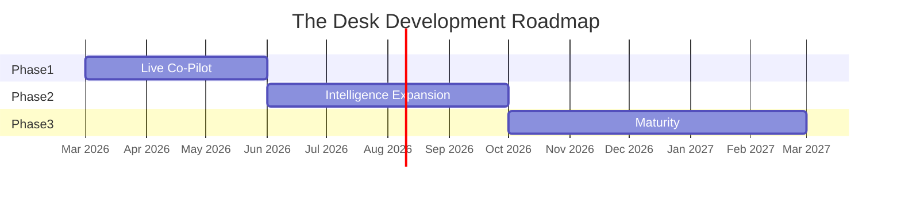
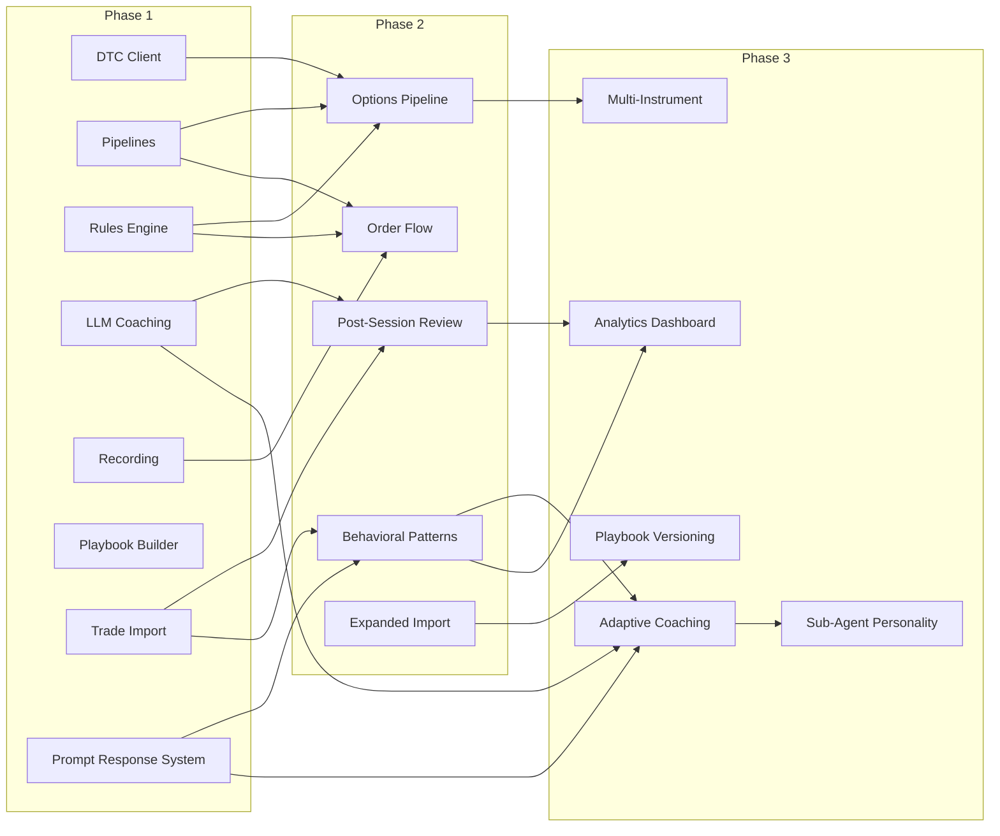
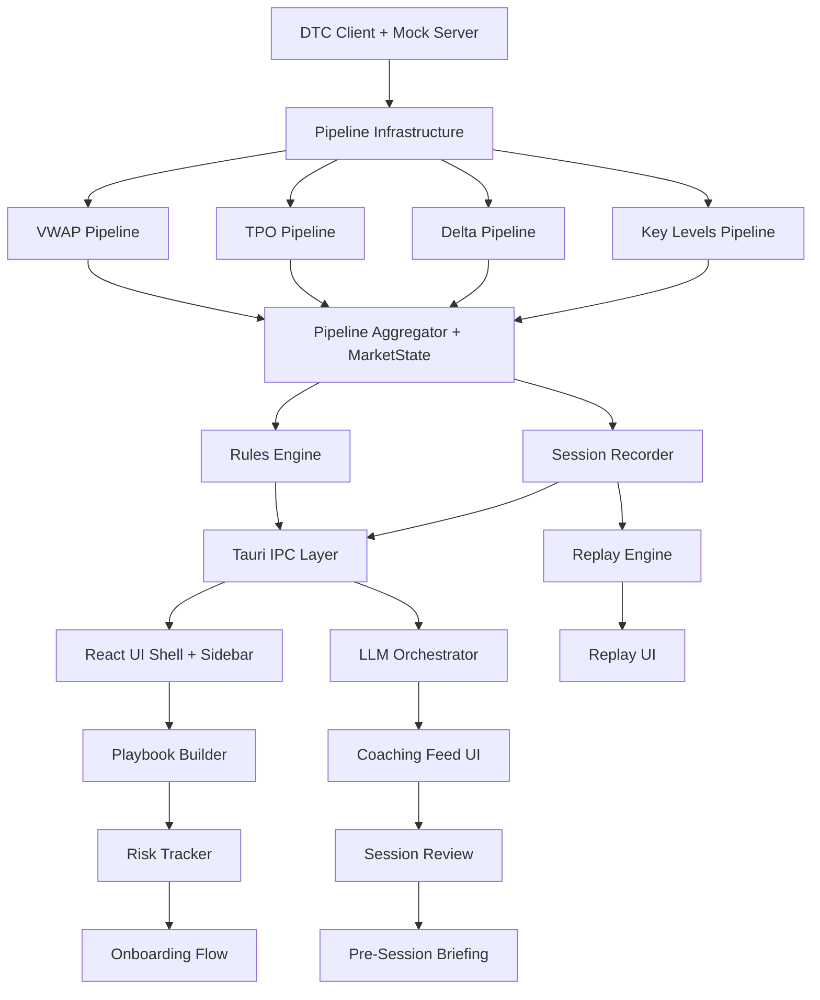

# The Desk — Roadmap

**Version:** 1.0
**Date:** 2026-02-25

---

## 1. Phase Overview

| Phase | Name | Focus | Timeline | PRD |
|-------|------|-------|----------|-----|
| 1 | Live Co-Pilot | Core value: real-time coaching during a live NQ session | Months 1-3 | [phase-1-prd.md](phase-1-prd.md) |
| 2 | Intelligence Expansion | Options/gamma, order flow, behavioral patterns, post-session review | Months 4-7 | [phase-2-prd.md](phase-2-prd.md) |
| 3 | Maturity | Adaptive coaching, multi-instrument, analytics, playbook versioning | Months 8-12 | [phase-3-prd.md](phase-3-prd.md) |

---

## 2. Phase Entry / Exit Criteria

### Phase 1 Entry
- Planning documents complete and aligned (this work)
- Development environment configured (Tauri 2.x, Rust toolchain, React 19, Sierra Chart with DTC enabled)

### Phase 1 Exit
- All P0 requirements implemented and tested
- First live co-pilot session completed within 1 hour of installation
- Session recording/replay fully functional
- Pipeline latency consistently <50ms
- 5+ real sessions recorded and replayed successfully
- Phase 1 open questions resolved (see [decision-log.md](decision-log.md))

### Phase 2 Entry
See [phase-2-prd.md](phase-2-prd.md) Section 2 for detailed entry criteria.

### Phase 2 Exit
- Options pipeline stable for 10+ sessions
- Behavioral pattern recognition producing statistically significant insights
- Post-session review completed for >80% of sessions
- 60+ session days of data accumulated

### Phase 3 Entry
See [phase-3-prd.md](phase-3-prd.md) Section 2 for detailed entry criteria.

### Phase 3 Exit
- Adaptive coaching producing measurably different prompts per trader
- At least 2 instruments supported (NQ + ES)
- Playbook versioning with performance diff functional
- Trader reports their Desk is "genuinely unique to them"

---

## 3. Inter-Phase Dependencies

---

## 4. Requirements Traceability

Maps vision pillars from [the-desk-vision.md](the-desk-vision.md) to concrete phase requirements.

### Vision Pillar: Close the Knowledge-Execution Gap

| Requirement Area | Phase 1 | Phase 2 | Phase 3 |
|-----------------|---------|---------|---------|
| Playbook definition | PB-01..18 | BT-01..05 | VER-01..05 |
| Real-time rule evaluation | RE-01..09 | FLOW-01..08 | ADAPT-01..11 |
| Contextual coaching prompts | LLM-01..15 | REV-05 | AGENT-01..05 |
| Risk management | RISK-01..07 | -- | MULTI-09 |

### Vision Pillar: The Trader's Own Plan, Reflected Back

| Requirement Area | Phase 1 | Phase 2 | Phase 3 |
|-----------------|---------|---------|---------|
| Backtest-anchored coaching | PB-10..12, LLM-02 | BT-01..05 | VER-03 |
| Compliance language | LLM-10 (prompt-spec.md) | REV-05 | ADAPT-11 |
| Never generate signals | Architectural constraint (CLAUDE.md) | BPR-10 | -- |

### Vision Pillar: Full Session Lifecycle

| Requirement Area | Phase 1 | Phase 2 | Phase 3 |
|-----------------|---------|---------|---------|
| Pre-session briefing | BRIEF-01..09 | BPR-08 | ADAPT-03..04 |
| Live coaching | LLM-01..15, LOG-08..13 | OPT-10, FLOW-06 | ADAPT-01..11 |
| Post-session review | LOG-01..07, LOG-14..16 | REV-01..08 | APR-01..07 |
| Long-term evolution | -- | BPR-01..10 | VER-01..05, PERF-01..06 |

### Vision Pillar: Record Everything, Learn from Everything

| Requirement Area | Phase 1 | Phase 2 | Phase 3 |
|-----------------|---------|---------|---------|
| Session recording | REC-01..09 | FLOW-07 | MULTI-10 |
| Tape replay | RPL-01..11 | -- | -- |
| Pattern recognition | -- | BPR-01..10 | APR-01..07 |
| Performance analytics | -- | REV-01..04 | PERF-01..06 |

### Vision Pillar: Deeply Personal Over Time

| Requirement Area | Phase 1 | Phase 2 | Phase 3 |
|-----------------|---------|---------|---------|
| Behavioral analysis | -- | BPR-01..10 | APR-01..07 |
| Adaptive coaching | -- | -- | ADAPT-01..11 |
| Coaching personality | LLM-07 (configurable) | -- | AGENT-01..05 |
| Playbook evolution | PB-15 (edit/delete) | BT-05 (versioned import) | VER-01..05 |

---

## 5. Phase 1 Implementation Sequence

Suggested implementation order for Phase 1, based on dependencies:

**Recommended milestone order:**

1. **M1: Data Foundation** — DTC client, mock server, pipeline infrastructure
2. **M2: Market Structure** — All 4 pipelines + aggregator + MarketState
3. **M3: Intelligence** — Rules engine + risk tracker
4. **M4: UI Shell** — React app, sidebar, risk bar, Tauri IPC
5. **M5: Coaching** — LLM orchestrator + coaching feed + prompt response system
6. **M6: Playbook** — Builder UI + LLM chat assist + templates
7. **M7: Recording** — Session recorder + replay engine + replay UI
8. **M8: Lifecycle** — Pre-session briefing + post-session review + onboarding
9. **M9: Polish** — Keyboard shortcuts, notification sounds, density settings, documentation

---

*The Desk — Where serious traders do serious work.*
