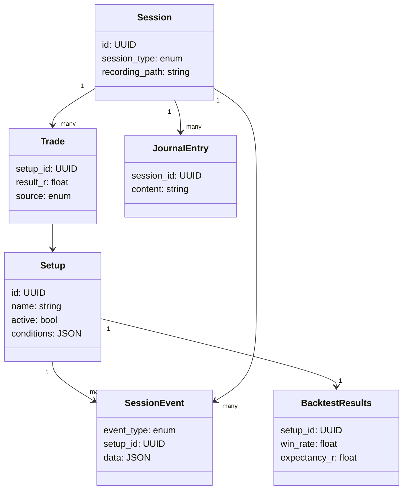
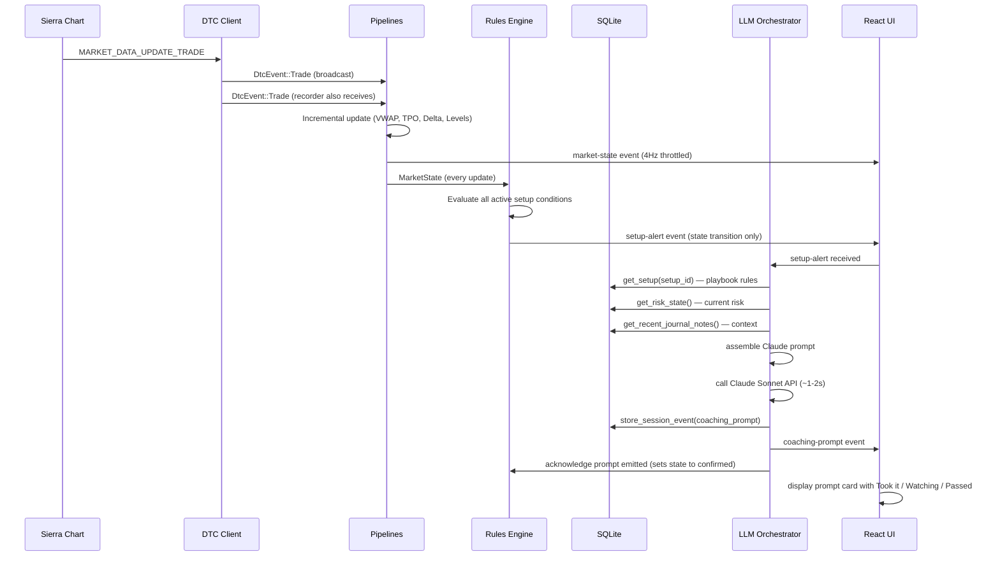
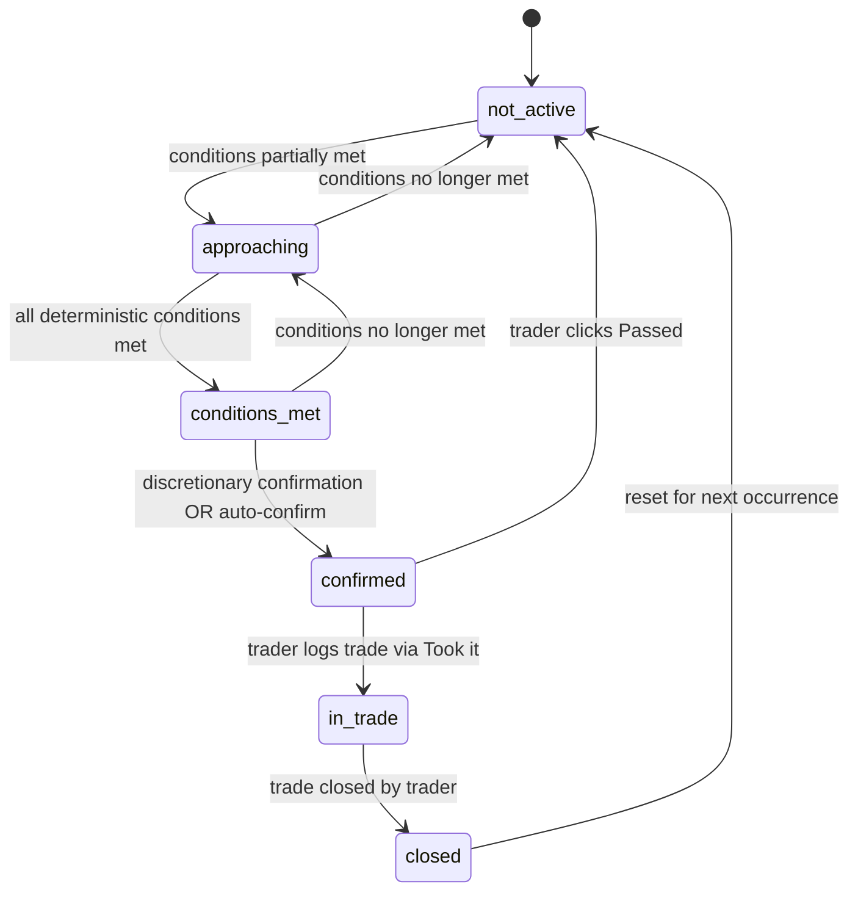

# Tech Plan — The Desk

## Overview

This document defines the technical architecture for The Desk Phase 1. It covers three sections: Architectural Approach (key decisions and rationale), Data Model (SQLite schema and recording format), and Component Architecture (component responsibilities and interfaces). All decisions reference [CLAUDE.md](../CLAUDE.md) as the authoritative constraint document and [core-flows.md](core-flows.md) for what each layer must produce.

**Three decisions locked in prior to this plan:**

1. Session recorder captures raw ticks + periodic pipeline snapshots (every 30s) for accurate scrubbing
2. Rules engine implements the full 6-state machine from Phase 1
3. LLM context is assembled in TypeScript (Rust emits minimal alert; TypeScript fetches playbook, risk state, and journal notes via commands before calling Claude)

---

## 1. Architectural Approach

### Layer Separation (Non-Negotiable)

The system is strictly layered. No layer may call upward or skip a layer.


| Layer                | Runtime          | Responsibility                                     | Latency Budget |
| -------------------- | ---------------- | -------------------------------------------------- | -------------- |
| 0 — DTC Client       | Rust             | TCP connection, binary framing, event emission     | <10ms          |
| 1 — Pipelines        | Rust             | Incremental market structure computation           | <50ms          |
| 2 — Rules Engine     | Rust             | Deterministic playbook condition evaluation        | <100ms         |
| 3 — LLM Orchestrator | TypeScript       | Context assembly, Claude API call, prompt emission | <2s            |
| 4 — UI               | React/TypeScript | Display only — no business logic                   | 60fps          |


**Why this matters:** Layers 0–2 must work without any network connectivity. The app degrades gracefully when Claude API is unreachable — raw alerts display without coaching prose. The rules engine never waits on the LLM.

### Event Bus Architecture

The DTC client emits a `DtcEvent` enum through a `tokio::sync::broadcast` channel. All pipeline consumers subscribe independently. This decouples the data source from all consumers and allows the session recorder to subscribe without affecting pipeline processing.

```
DTC Client → broadcast channel → [Pipelines, Session Recorder, Replay Engine]
```

### Throttled UI Updates

Pipelines process at data-feed speed (100–500 messages/second during active markets). The UI receives aggregated `MarketState` snapshots at 4Hz (every 250ms). Coaching prompts are emitted immediately when generated — they are not throttled.

### LLM Context Strategy

Rust emits a minimal `SetupAlert` (setup ID, state transition, triggered conditions, current price). TypeScript makes 3 sequential Tauri command calls to fetch: (1) full playbook rules for the setup, (2) current risk state, (3) up to 3 recent relevant journal entries. It then assembles the Claude prompt and calls the API. This keeps prompt engineering fully in TypeScript and avoids coupling Rust to LLM context requirements. **Only `conditions_met` transitions trigger Claude calls**; other transitions are used for UI state and logging.

**Tradeoff accepted:** 3 extra round-trips add ~5–15ms before the Claude call. This is negligible against the 1–2 second LLM latency budget.

### Recording Strategy

The session recorder writes two interleaved record types to a single binary file:

- **Tick records** — every trade, quote, and DOM update as received from DTC
- **Pipeline snapshot records** — full `MarketState` struct every 30 seconds

On replay, the engine builds an in-memory index of snapshot offsets on first load. Scrubbing to timestamp T: load the nearest snapshot before T, restore pipeline state from it, then replay tick records from that point forward. This gives accurate scrubbing with at most 30 seconds of recomputation.

### Graceful Degradation


| Failure                 | Behavior                                                                                       |
| ----------------------- | ---------------------------------------------------------------------------------------------- |
| DTC disconnected        | Auto-reconnect with exponential backoff; UI shows disconnected state; session recording pauses |
| Claude API unreachable  | Raw `SetupAlert` displayed as coaching prompt with `source: "raw"` label; no crash             |
| SQLite write failure    | Log error; continue session; attempt retry on next write                                       |
| Recording write failure | Log error; continue session; mark session as "recording incomplete"                            |


---

## 2. Data Model

### SQLite Schema

All data is stored locally at `~/.the-desk/data.db`. WAL mode enabled. Schema versioned with a `schema_version` table for migrations.

**Core entities and key fields:**

```
setups
  id (UUID), name, description, active (bool)
  conditions (JSON), discretionary_conditions (JSON)
  entry_logic (JSON), stop_logic (JSON), targets (JSON)
  position_sizing (JSON), market_context (JSON), invalidation (JSON)
  notes, created_at, updated_at

backtest_results
  id, setup_id → setups.id
  period, samples, win_rate, avg_winner_r, avg_loser_r
  profit_factor, max_consecutive_losses, max_drawdown_r, expectancy_r
  source, imported_at

sessions
  id (UUID), date, session_type (rth | globex | replay)
  start_time, end_time, recording_path

session_events
  id (UUID), session_id → sessions.id
  timestamp, event_type, setup_id → setups.id (nullable), data (JSON)

  event_type values:
    alert_fired | coaching_prompt | risk_warning | trader_note
    trade_entry | trade_exit | setup_condition_met | prompt_response

  prompt_response data shape:
    { prompt_event_id: UUID, response: "took_it"|"watching"|"passed", note: string|null }

trades
  id (UUID), session_id → sessions.id, setup_id → setups.id (nullable)
  entry_time, entry_price, exit_time, exit_price
  direction (long | short), size, stop_price, target_prices (JSON)
  result_r, planned (bool), rules_followed (bool|null)
  emotional_state, notes, source (manual | imported_csv)

risk_config
  id (singleton = 1)
  r_value_points, r_value_dollars
  max_daily_loss_r, max_consecutive_losses, max_trades_per_session
  no_trade_zones (JSON array of TimeRange)

journal_entries
  id (UUID), session_id → sessions.id (nullable)
  date, content, tags (JSON), setup_references (JSON), trade_references (JSON)
  created_at
```

**Key relationships:**



### Recording File Format

Binary file at `~/.the-desk/recordings/{session_id}.desk`. Entire file is zstd-compressed.

**File header (64 bytes, fixed):**


| Field           | Type             | Size |
| --------------- | ---------------- | ---- |
| Magic           | bytes `DESK`     | 4    |
| Schema version  | uint16           | 2    |
| Session ID      | UTF-8 string     | 36   |
| Start timestamp | f64 (Unix epoch) | 8    |
| Reserved        | —                | 14   |


**Record structure (variable length):**


| Field        | Type   | Size     |
| ------------ | ------ | -------- |
| Timestamp    | f64    | 8        |
| Record type  | uint8  | 1        |
| Payload size | uint32 | 4        |
| Payload      | bytes  | variable |


**Record types:**


| Type             | Hex    | Payload                                                        |
| ---------------- | ------ | -------------------------------------------------------------- |
| Trade            | `0x01` | price (f64), volume (f64), side (uint8)                        |
| Quote            | `0x02` | bid (f64), ask (f64), bid_size (f32), ask_size (f32)           |
| Depth            | `0x03` | side (uint8), price (f64), quantity (f64), update_type (uint8) |
| PipelineSnapshot | `0x04` | full `MarketState` struct (MessagePack serialized)             |
| RulesEvent       | `0x05` | setup_id (36 bytes), state (uint8), conditions_met (JSON)      |
| CoachingPrompt   | `0x06` | setup_id (36 bytes), source (uint8), text (UTF-8)              |
| SessionStart     | `0x07` | empty                                                          |
| SessionEnd       | `0x08` | empty                                                          |


**Scrub index:** Built in memory on first load. Maps each `PipelineSnapshot` record to its byte offset and timestamp. Enables O(log n) seek by timestamp.

---

## 3. Component Architecture

### Live Coaching Data Flow



### Rules Engine State Machine



**State transition events emitted:**

- `approaching` → fires "watching" soft notification in UI
- `conditions_met` → emits `SetupAlert` to the TypeScript orchestrator and immediately triggers coaching prompt generation (auto-confirm path)
- `confirmed` → entered after the coaching prompt is successfully generated and emitted; the TypeScript orchestrator acknowledges this back to Rust so the rules engine can represent "prompt displayed" deterministically
- `in_trade` → activates trade management prompt monitoring
- `closed` → fires post-trade summary prompt

### Rust Backend Components


| Component               | Responsibility                                                          | Consumes                                | Emits                                                            |
| ----------------------- | ----------------------------------------------------------------------- | --------------------------------------- | ---------------------------------------------------------------- |
| **DTC Client**          | TCP connection, binary framing, reconnection, heartbeat                 | Sierra Chart TCP stream                 | `DtcEvent` broadcast channel                                     |
| **VWAP Pipeline**       | Incremental VWAP + 1σ/2σ/3σ bands, session reset                        | `DtcEvent::Trade`                       | `VwapState`                                                      |
| **TPO Pipeline**        | Incremental TPO profile, VA/POC/singles, OR/IB tracking                 | `DtcEvent::Trade`                       | `TpoState`                                                       |
| **Delta Pipeline**      | Incremental delta profile, DNVA/DNP, cumulative delta                   | `DtcEvent::Trade` + `DtcEvent::Quote`   | `DeltaState`                                                     |
| **Levels Pipeline**     | Prior day H/L/C, overnight H/L, prior VA/POC, round numbers             | `DtcEvent::Trade` + stored session data | `LevelsState`                                                    |
| **Risk Tracker**        | Daily P&L in R, trade count, consecutive losses, drawdown               | Trade events + `RiskConfig`             | `RiskState`                                                      |
| **Pipeline Aggregator** | Collects all pipeline outputs into `MarketState`, throttled emit        | All pipeline states                     | `market-state` Tauri event (4Hz) + `MarketState` to Rules Engine |
| **Rules Engine**        | Evaluates setup conditions, manages 6-state machine per setup           | `MarketState` + active `Setup` list     | `setup-alert` Tauri event                                        |
| **Session Recorder**    | Writes tick records + 30s pipeline snapshots to binary file             | `DtcEvent` broadcast + `MarketState`    | Recording file                                                   |
| **Replay Engine**       | Reads recording, emits `DtcEvent` at original or accelerated timestamps | Recording file                          | `DtcEvent` broadcast (same as live DTC client)                   |
| **Database**            | SQLite CRUD for all persistent entities                                 | Tauri commands                          | Query results                                                    |
| **Tauri Commands**      | Thin IPC wrappers over database operations                              | Frontend `invoke()` calls               | `Result<T, String>`                                              |


### TypeScript Frontend Components


| Component                | Responsibility                                        | Consumes                  | Emits/Produces                                        |
| ------------------------ | ----------------------------------------------------- | ------------------------- | ----------------------------------------------------- |
| **LLM Orchestrator**     | Context assembly, Claude API call, prompt storage     | `setup-alert` Tauri event | `coaching-prompt` Tauri event + stored `SessionEvent` |
| **Tauri Bridge**         | All `invoke()` calls, organized by domain namespace   | Component/hook calls      | Tauri command results                                 |
| **useMarketState**       | Market state subscription                             | `market-state` event      | `MarketState` to context                              |
| **useCoachingPrompts**   | Coaching prompt log                                   | `coaching-prompt` event   | Append-only `CoachingPrompt[]` to context             |
| **useRiskState**         | Risk state subscription                               | `risk-state` event        | `RiskState` to context                                |
| **useConnection**        | DTC connection status                                 | `dtc-status` event        | `ConnectionStatus` to context                         |
| **useSetupAlerts**       | Rules engine state display                            | `setup-alert` event       | Per-setup state for sidebar                           |
| **App Context**          | Global state provider                                 | All hooks                 | Context to all components                             |
| **Coaching Feed**        | Prompt cards with Took it/Watching/Passed             | App Context               | `prompt_response` SessionEvent via command            |
| **Market State Sidebar** | VWAP, VA, DNVA, delta, key levels display             | App Context               | —                                                     |
| **Risk Bar**             | P&L, trade count, consecutive losses, limit proximity | App Context               | —                                                     |
| **Playbook Builder**     | Multi-step setup definition form with LLM chat assist | Tauri Bridge              | Setup via command                                     |
| **Replay Controls**      | Play/pause, speed, scrub bar                          | Tauri Bridge              | Replay commands                                       |
| **Session Review**       | Post-session trade tagging, journal, adherence score  | Tauri Bridge              | Trade updates, journal entries via commands           |


### Key Interface Contracts

`**SetupAlert` (Rust → TypeScript via Tauri event):**

```
setup_id: UUID
setup_name: string
state_transition: "approaching" | "conditions_met" | "confirmed" | "in_trade" | "closed"
triggered_conditions: string[]   // human-readable condition descriptions
current_price: f64
timestamp: f64
```

`**MarketState` (Rust → TypeScript via Tauri event, 4Hz):**

```
last_price, bid, ask
vwap, vwap_1sd_upper, vwap_1sd_lower, vwap_2sd_upper, vwap_2sd_lower
va_high, va_low, poc
dnva_high, dnva_low, dnp
session_delta, cumulative_delta
prior_day_high, prior_day_low, prior_day_close
overnight_high, overnight_low
or_high, or_low, ib_high, ib_low
```

`**CoachingPrompt` (TypeScript → TypeScript via Tauri event):**

```
id: UUID
session_event_id: UUID
setup_id: UUID | null
setup_name: string
message: string
priority: "info" | "alert" | "warning" | "critical"
source: "llm" | "raw"
timestamp: f64
```

---

## 4. Configuration Schema

All user configuration lives at `~/.the-desk/config.toml`. The app creates this file with defaults on first launch.

### 4.1 Full Schema

```toml
# The Desk Configuration
# Edit this file to customize behavior. Some changes require restart (noted below).

[connection]
# DTC server connection (restart required)
host = "localhost"
port = 11099
symbol = "NQ"
reconnect_interval_ms = 5000
max_reconnect_attempts = 0  # 0 = unlimited

[risk]
# Risk management defaults (editable in-app without restart)
r_value_points = 10.0       # NQ points per 1R
r_value_dollars = 50.0      # Dollar value of 1R (r_value_points * $5/point)
max_daily_loss_r = 3.0
max_consecutive_losses = 3
max_trades_per_session = 0  # 0 = unlimited

[[risk.no_trade_zones]]
# Repeatable section for no-trade time windows
start = "09:30"             # ET
end = "09:35"               # ET
label = "First 5 minutes"

[session]
# Session behavior (runtime changeable)
auto_start_rth = true            # Auto-start session at RTH open
auto_end_rth = false             # Auto-end at RTH close (trader confirms)
briefing_minutes_before = 15     # Minutes before RTH open to generate briefing
recording_enabled = true
recording_path = "~/.the-desk/recordings"

[recording]
# Recording parameters (restart required)
dom_snapshot_interval_ms = 100   # DOM snapshot frequency
pipeline_snapshot_interval_s = 30 # Pipeline state snapshot frequency
compression_level = 3            # zstd compression level (1-22, default 3)

[llm]
# Claude API configuration (restart required for model changes)
api_key_env = "ANTHROPIC_API_KEY"  # Environment variable name for API key
coaching_model = "claude-sonnet-4-6-20260301"
analysis_model = "claude-opus-4-6-20260301"
timeout_ms = 5000
max_retries = 1
temperature = 0.3                # Low temperature for consistent coaching

[llm.personality]
# Coaching voice (runtime changeable)
style = "direct"                 # direct | analytical | minimal | motivational
verbosity = "normal"             # brief | normal | detailed

[ui]
# Display preferences (runtime changeable)
density = "normal"               # compact | normal | comfortable
sidebar_visible = true
notification_sounds = false
font_scale = 1.0                 # 0.8 to 1.3

[database]
# SQLite configuration (restart required)
path = "~/.the-desk/data.db"
wal_mode = true
```

### 4.2 Configuration Precedence

1. **Command-line flags** (highest) — override config file for debugging
2. **Config file** (`~/.the-desk/config.toml`)
3. **Built-in defaults** (lowest) — used when config file is missing or key is absent

### 4.3 Runtime vs Restart

| Category | Runtime Changeable | Restart Required |
|----------|:-----------------:|:----------------:|
| Risk parameters | Yes | -- |
| Session behavior | Yes | -- |
| UI preferences | Yes | -- |
| LLM personality | Yes | -- |
| DTC connection | -- | Yes |
| LLM model selection | -- | Yes |
| Recording parameters | -- | Yes |
| Database path | -- | Yes |

### 4.4 API Key Storage

API keys are **never stored in the config file**. The `api_key_env` field specifies which environment variable to read. In production, this supports:

1. **Environment variable** (default) — `ANTHROPIC_API_KEY` set in user's shell profile
2. **System keychain** (future Phase 1 enhancement) — Windows Credential Manager via `keyring` crate
3. **.env file** (development only) — `.env` at project root, gitignored

### 4.5 Validation Rules

| Field | Validation |
|-------|-----------|
| `port` | 1-65535 |
| `r_value_points` | > 0 |
| `max_daily_loss_r` | > 0 |
| `max_consecutive_losses` | >= 0 (0 = disabled) |
| `dom_snapshot_interval_ms` | 50-1000 |
| `pipeline_snapshot_interval_s` | 5-120 |
| `compression_level` | 1-22 |
| `temperature` | 0.0-1.0 |
| `font_scale` | 0.8-1.3 |
| `no_trade_zones` | start < end, valid ET times |

On validation failure at startup, the app logs the error, uses the default value for that field, and shows a warning in the UI: "Configuration warning: {field} has invalid value {value}, using default {default}."

---

## 5. Testing Strategy

### 5.1 Test Data

#### Known NQ Data Samples

All pipeline tests use a canonical test data set of NQ trades with known expected outputs. The data set covers:

| Scenario | Description | Expected Outputs |
|----------|-------------|-----------------|
| Simple trend up | 100 trades, monotonic price increase 21,400 → 21,500 | VWAP tracks midpoint, delta positive, cumulative delta increasing |
| Simple trend down | 100 trades, monotonic price decrease 21,500 → 21,400 | VWAP tracks midpoint, delta negative |
| Range day | 500 trades, price oscillates 21,420 - 21,480 | VA narrow, POC near VWAP, DNVA defined |
| Trend day | 1,000 trades, directional with pullbacks | VA wide, single prints present, strong delta |
| Session boundary | Trades spanning 9:29 - 9:31 ET | VWAP resets at 9:30, OR tracking begins |
| OR/IB formation | First 60 minutes of RTH with known H/L | OR = first 30 min H/L, IB = first 60 min H/L |
| Delta divergence | Price new high, delta declining | DN-06 fires divergence alert |
| DOM snapshot sequence | 10 snapshots at 100ms intervals | Absorption/imbalance patterns detectable |

Data files stored at `test-data/` (or under `src/` during development) as JSON arrays of trade records.

### 5.2 Pipeline Unit Tests

Each pipeline has unit tests that:

1. Load the canonical test data
2. Feed trades incrementally (one at a time, simulating live)
3. Compare output against manually verified expected values
4. Test session boundary resets
5. Test incremental consistency (result after N trades = result of processing N trades one by one)

**Required assertions per pipeline:**

| Pipeline | Key Assertions |
|----------|---------------|
| VWAP | VWAP value matches manual calculation to 6 decimal places; bands track correctly |
| TPO | VA encompasses 70% of TPOs; POC is the level with the highest count; single prints identified |
| Delta | DNVA encompasses 70% of absolute delta; DNP is at cumulative delta zero-crossing; trade direction classified correctly |
| Levels | Prior day H/L/C loaded from stored data; overnight H/L tracked; OR/IB computed at correct time boundaries |
| Risk | P&L in R matches manual calculation; consecutive losses counted correctly; limit breaches fire alerts |

### 5.3 Rules Engine Tests

| Test Category | Examples |
|---------------|---------|
| Single condition | Price above VWAP → condition met |
| Compound conditions | Price above VWAP AND session delta positive AND time after 9:35 → all three must be true |
| State machine transitions | not_active → approaching → conditions_met → confirmed → in_trade → closed |
| Edge cases | All conditions met then one un-met → back to approaching; no active setups → no evaluation |
| Risk suppression | Setup conditions met but daily loss limit reached → no alert fired |
| Duplicate suppression | Same setup triggers twice within suppression window → second alert suppressed |

### 5.4 DTC Client Tests

Integration tests with a mock DTC server (`cargo run --bin mock-dtc-server`):

| Test | Behavior |
|------|----------|
| Connection handshake | ENCODING_REQUEST → ENCODING_RESPONSE → LOGON_REQUEST → LOGON_RESPONSE |
| Market data subscription | MARKET_DATA_REQUEST → MARKET_DATA_UPDATE_TRADE messages flow |
| Heartbeat exchange | Client sends HEARTBEAT within negotiated interval; server responds |
| Reconnection | Server drops connection → client reconnects with exponential backoff |
| Buffered reads | Server sends partial TCP messages → client buffers and parses correctly |
| Multi-symbol | Subscribe to NQ and ES simultaneously (Phase 3 prep) |

Mock server specification:
- Listens on `localhost:11099`
- Responds to all DTC handshake messages per protocol spec
- Streams synthetic NQ trades at configurable rate (default: 5/sec)
- Supports DOM snapshot responses with 10 levels per side
- Can replay a recorded session file for deterministic tests

### 5.5 LLM Coaching Tests

| Test Type | Method | What It Validates |
|-----------|--------|-------------------|
| Prompt assembly | Unit test | Context correctly assembled from setup + risk + journal data |
| Template completeness | Unit test | All template variables populated, no `{undefined}` in output |
| Banned phrase scan | Unit test | Output contains no advisory language (regex against banned list from prompt-spec.md) |
| Attribution check | Unit test | Every statement uses an approved attribution pattern |
| Graceful degradation | Integration test | Raw alert displayed when Claude API returns error |
| Latency | Integration test | Alert-to-prompt-displayed < 2 seconds (95th percentile) |
| Snapshot | Golden file test | Known input produces expected prompt structure (not exact match — structure and completeness) |

**Avoiding API costs in CI:** Snapshot tests use pre-saved Claude API responses. Only manual integration tests call the live API.

### 5.6 UI Component Tests

| Component | Test Focus |
|-----------|-----------|
| Coaching prompt card | Renders all three response buttons; keyboard shortcuts work; card collapses after response |
| Risk bar | Updates at 4Hz; warning/critical states apply correct colors |
| Market state sidebar | Values update; labels correct; collapsible behavior works |
| Playbook builder | Multi-step form validates required fields; LLM chat assist works |
| Replay controls | Play/pause toggles; speed changes; scrub bar seeks to timestamp |
| Onboarding wizard | All 4 steps navigate correctly; skip works; validation enforces required fields |
| Session review | Trade cards display; tagging inputs save; adherence metrics calculate |

### 5.7 Performance Benchmarks

Run as part of CI (non-blocking) and before each release:

| Metric | Target | Measurement |
|--------|--------|-------------|
| Pipeline latency (1 trade) | <50ms | Rust benchmark harness |
| Pipeline throughput | >500 trades/sec | Process 10,000 trades, measure total time |
| Rules engine evaluation | <100ms for 10 active setups | Benchmark with full MarketState |
| Memory at steady state | <500MB | 30-minute simulated session, measure RSS |
| UI render frame time | <16.6ms (60fps) | Browser DevTools performance trace |
| Recording write throughput | >1,000 records/sec | Write 100,000 records, measure total time |
| Session load time | <3 seconds | Load a 6.5-hour RTH recording |

### 5.8 Integration Test Flow

End-to-end test covering the full pipeline:

```
Mock DTC Server
  → DTC Client (connects, subscribes)
    → Pipelines (process 1,000 synthetic trades)
      → Rules Engine (evaluates 3 active setups)
        → LLM Orchestrator (uses saved response, not live API)
          → UI (coaching prompt appears, response recorded)
            → Session Recorder (verify recording file)
              → Replay Engine (replay recording, verify identical outputs)
```

This test runs in CI with `cargo test --features integration` and takes <30 seconds.