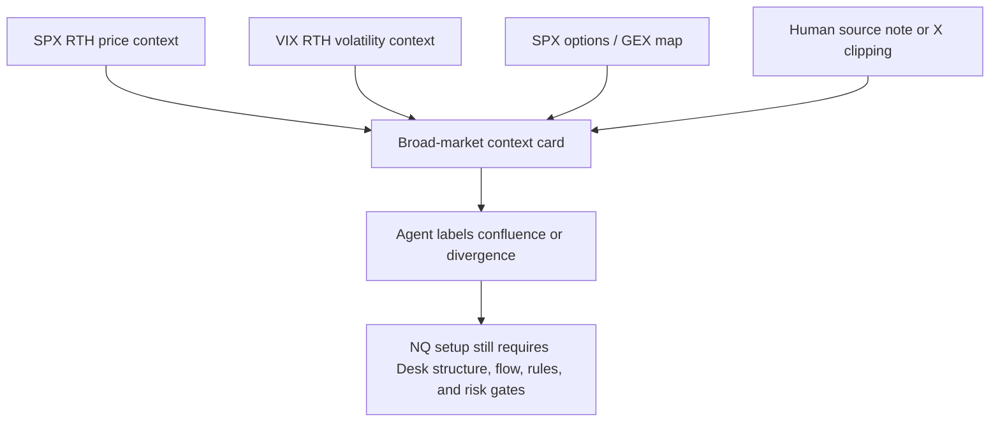

# IDEA-028 - SPX/VIX RTH Context Feed for Agents

> Docs-only design captured 2026-07-09. This is a market-context proposal, not a
> setup, not a signal, and not a request to trade or change Sierra Chart.

## Thesis

Alec now has SPX and VIX charts in Sierra Chart. If Sierra is writing those
charts to `.scid`, The Desk should let agents see a small, RTH-only broad-market
context packet: SPX direction/range state plus VIX level/change state. The value
is highest when paired with SPX options/GEX maps or human-supplied X/source notes.

This should be a "weather report" for NQ interpretation:

- SPX tells the agent whether the broad index tape is accepting risk-on/risk-off
  during RTH.
- VIX tells the agent whether volatility is being bid, offered, or flat during
  the same RTH window.
- Options/GEX maps explain where dealer-flow context may matter.
- NQ structure, flow, rules, and risk still decide whether anything is actionable.

## Repo Evidence Checked

- `docs/sierra-chart-settings.md` and `docs/data-and-backtesting-guide.md` say the
  documented recorded-symbol set is NQ, MNQ, ES, and MES. They do not currently
  list SPX or VIX as confirmed recorded files.
- `src/feed/scid_reader.rs` is a generic Sierra `.scid` parser for 40-byte
  records, timestamp conversion, price scaling, bounded scans, and live tailing.
- `src/feed/symbol_resolution.rs` can resolve a symbol to `<SYMBOL>.scid`, but it
  is designed around a configured futures root/contract and freshness-based
  active-contract detection.
- `src/bin/the-desk-mcp/main.rs` starts one active `ScidReader` from the feed
  config, replays/tails it through the main `PipelineEngine`, and writes
  `raw_ticks` tagged by root/contract.
- `src/lib.rs` defines RTH as 09:30 to 16:15 Eastern and already provides the
  session classifier needed for RTH-only filtering.
- `src/bin/the-desk-mcp/tools/options.rs` already exposes SPX/ConvexValue
  context through `get_gamma_levels`, `get_options_context`, and
  `refresh_options_snapshot`.

Boundary note: the original dispatch run did not inspect the local Sierra data
directory or `~/.the-desk/config.toml`. Alec confirmed file existence and
freshness on 2026-07-09 via directory listing only (no file contents opened).

## Current State

Confirmed from repo-safe docs: the forward-recorded futures feed is NQ, MNQ, ES,
and MES. SPX/VIX are not yet in the repo's documented recorded-symbol list.

### Confirmed on machine (2026-07-09, listing only)

Sierra is actively recording both symbols through the **Denali Exchange Data Feed**
(exchange = **CBOE Global Indexes**), not Rithmic. See
[sierra-chart-spx-data-and-performance-2026-07-08.md](../sierra-chart-spx-data-and-performance-2026-07-08.md).

| Symbol / file | Feed | Status (2026-07-09) |
|---------------|------|---------------------|
| `SPX_CGI.scid` | Denali / CBOE Global Indexes | Live, ~125 MB, actively updating |
| `VIX_CGI.scid` | Denali / CBOE Global Indexes | Live, ~16 MB, actively updating |
| `$INX.scid` | Delayed/historical SPX symbol | Has data but is not the live feed |
| `SPX.scid`, `SPXOptions.scid`, etc. | — | 56-byte empty-header stubs = never activated |

The `_CGI` suffix is the CBOE Global Indexes feed tag, distinct from Rithmic-fed
NQ/ES/MNQ/MES `.scid` files. A 56-byte header-only file is a reliable "nothing
recorded" signal in this directory.

**Build caveat:** Denali index feeds may use different price-scale or record-format
conventions than the Rithmic futures feed `ScidReader` was built against. Before
any implementation, validate price scale and parsed values against known-good
Sierra chart prints — do not assume futures defaults.

Current ingestion can probably parse an SPX/VIX `.scid` file at the binary-file
level if the file is standard Sierra intraday data and the price scale is known.
That does not make it safe to feed SPX/VIX into the current live pipeline:

- The live server has one active configured contract, not a separate context-file
  reader set.
- Several pipelines and fallback assumptions are NQ/futures-oriented.
- Cash-index/VIX charts may have weak or meaningless volume, bid/ask, and delta
  fields compared with NQ trade tape.
- Symbol auto-detection is futures-contract oriented; SPX/VIX should be explicit
  config entries, not inferred as front-month contracts.

## Smallest Repo-Native Design

Use a derived RTH snapshot and expose it through a small new MCP read tool. Do
not add SPX/VIX to `MarketState`, the rules engine, setup templates, or raw
trade-signal logic in the first slice.

Proposed future tool:

```text
get_broad_market_context()
```

Layer placement:

- Config: optional `[context_feeds]` entries for `SPX_CGI` and `VIX_CGI` with
  explicit file names (`SPX_CGI.scid`, `VIX_CGI.scid`), price scales, labels,
  and `enabled = true`.
- Data access: read-only bounded `.scid` scans using `ScidReader`, filtered to
  RTH by `tick_time_context_from_timestamp_ms`.
- Computation: derived snapshot only; no TPO, DNVA, footprint, tape pace,
  absorption, or rules-engine evaluation.
- MCP domain: Market or Options. Market is clearer if the output is SPX/VIX
  chart context; Options is clearer only if it is bundled with
  `get_options_context`. Prefer Market for separation.
- Persistence: none for v1. Recompute on demand or cache in memory for a short
  TTL. Add SQLite persistence only if future research needs SPX/VIX conditionals.

Why not add fields to `get_market_snapshot` first? That tool describes the
active tradeable market state. SPX/VIX context is external context and should
not be confused with the NQ setup/rules snapshot.

## Snapshot Shape

Suggested structured output:

```json
{
  "sessionScope": "RTH",
  "asOfMs": 1780000000000,
  "status": "ok",
  "spx": {
    "symbol": "SPX",
    "fileStatus": "fresh",
    "rthOpen": 6200.25,
    "last": 6218.75,
    "rthHigh": 6225.5,
    "rthLow": 6192.0,
    "changeFromOpen": 18.5,
    "changeFromOpenPct": 0.298,
    "rangePosition": 0.78,
    "trendLabel": "riskOn"
  },
  "vix": {
    "symbol": "VIX",
    "fileStatus": "fresh",
    "rthOpen": 14.8,
    "last": 14.1,
    "rthHigh": 15.0,
    "rthLow": 13.9,
    "changeFromOpen": -0.7,
    "rangePosition": 0.18,
    "volLabel": "volOff"
  },
  "agentFrame": {
    "contextOnly": true,
    "suggestedPairings": ["get_gamma_levels", "get_options_context", "humanSourceNote"],
    "caveats": [
      "SPX/VIX are broad-market context, not NQ trade signals",
      "NQ playbook confirmation remains required",
      "stale or missing context must be reported as unavailable"
    ]
  }
}
```

`rangePosition` should be 0.0 at RTH low and 1.0 at RTH high. Labels should be
simple, derived, and non-advisory, for example `riskOn`, `riskOff`, `mixed`,
`volBid`, `volOff`, `flat`, or `unknown`.

## RTH Scoping

- Include only ticks classified as `SessionType::Rth` by the existing Eastern
  Time session helper.
- Reset each trading day at 09:30 ET.
- Stop the live RTH window at 16:15 ET, matching the repo's existing RTH close.
- Outside RTH, either return `status = "outsideRth"` with the last completed RTH
  summary marked stale, or return no current context. Do not mix Globex futures
  context with cash-index RTH context.
- If holiday/early-close support is added later, it should use the same calendar
  logic as the rest of The Desk instead of hardcoding a separate SPX/VIX calendar.

## Failure Modes

| Failure | Tool behavior | Agent framing |
|---------|---------------|---------------|
| SPX/VIX not configured | Return `status = "disabled"` or missing symbol entry | "SPX/VIX context is not configured." |
| `.scid` file missing | Return `fileStatus = "missing"` with no values | "Sierra context file is missing; do not infer." |
| File stale | Return stale age and cap status to warning | "Context may be stale; NQ read stands on its own." |
| No RTH records today | Return `status = "noRthData"` | "No RTH SPX/VIX context available yet." |
| Invalid SCID header | Return structured error, no panic | "Context feed unreadable." |
| Price scale wrong | Values fail sanity bounds; return warning | "Context feed needs scale check before use." |
| Volume/bid/ask empty | Ignore order-flow fields | "Use price/range only for SPX/VIX." |
| SPX up, VIX up | Return `mixed` | "Broad tape and vol are divergent; treat as uncertainty." |

The core NQ MCP tools should continue to work if every SPX/VIX context file is
missing, stale, disabled, or malformed.

## Agent Representation

The user specifically wants @convexvalue-style SPX flowcharts to be an
agent-visible representation, not a signal. The agent-facing artifact should be
a compact context card or flowchart that shows how SPX/VIX and options context
color the read without changing the playbook gate.



Allowed phrasing:

- "SPX is near the top of its RTH range while VIX is below its RTH open; that is
  supportive broad context for risk-on reads, but it is not an NQ signal."
- "SPX/VIX context is mixed, so do not use it as confluence."
- "This pairs with the SPX gamma map as context around likely broad-market
  pressure zones."

Avoid:

- "SPX/VIX says go long NQ."
- "VIX down confirms the setup."
- "The SPX flowchart is a signal."
- "Trade this because SPX and VIX align."

## Context vs Signal Contract

SPX/VIX may influence agent narration only after the agent has already pulled the
normal NQ baseline: session context, market snapshot/context frame, setup/rules
state, order-flow confirmation, and risk state.

SPX/VIX can:

- explain why a broad-market backdrop feels supportive or hostile;
- flag divergence between NQ and the broader index/vol complex;
- add context to SPX GEX/options walls;
- help interpret human source notes.

SPX/VIX cannot:

- fire an attention signal by itself;
- become a `ConditionField` without a later backtest-backed, trader-approved
  decision;
- adjust risk sizing;
- override NQ delta/footprint/playbook confirmation;
- be described as a validated edge.

## Open Questions

1. ~~What exact Sierra symbols/file names are used for SPX and VIX on this
   machine?~~ **Answered 2026-07-09:** `SPX_CGI.scid` and `VIX_CGI.scid` on the
   Denali/CBOE Global Indexes path; both actively recording.
2. Do Denali index `.scid` files use the same price scale and record layout
   `ScidReader` expects for Rithmic futures? Are SPX/VIX files tick-level enough
   for reliable intraday open, high, low, last, and freshness? Price-only is
   sufficient; delta is not needed.
3. Should v1 return only current RTH context, or also the previous completed RTH
   snapshot for premarket review?
4. Should the tool live under Market or Options?
5. Should SPX/VIX context later be persisted for research conditionals, or stay
   live-only unless a backtest question emerges?
6. How should a ConvexValue-style chart image/source note be attached to the MCP
   response: as user-supplied prose, cached source metadata, or a separate
   document link?

## Acceptance Criteria For A Future Build

- Works with SPX/VIX disabled, missing, or stale without affecting NQ tools.
- Reads only explicit context-feed `.scid` files and never auto-discovers private
  Sierra/account files.
- Filters every value to RTH and labels stale/outside-RTH state.
- Returns price/range/freshness context only; no SPX/VIX order-flow claims.
- Pairs cleanly with `get_gamma_levels` / `get_options_context`.
- Agent instructions frame the output as context, never as a signal.
- Unit tests cover missing file, stale file, no RTH records, invalid header,
  mixed SPX/VIX labels, and RTH boundary filtering.

## See also

- Hub stub: [setup-ideas-and-backtesting.md#idea-028](../setup-ideas-and-backtesting.md#idea-028)
- Setup ideas index: [index.md](index.md)
- Sierra SPX/Denali note: [sierra-chart-spx-data-and-performance-2026-07-08.md](../sierra-chart-spx-data-and-performance-2026-07-08.md)
- Sierra settings: [sierra-chart-settings.md](../sierra-chart-settings.md)
- Data guide: [data-and-backtesting-guide.md](../data-and-backtesting-guide.md)
- Options vendor/API bridge: [IDEA-027](IDEA-027-options-data-vendor-comparison.md)
- Market-maker pressure framing: [IDEA-024](IDEA-024-market-maker-pressure-inference.md)
