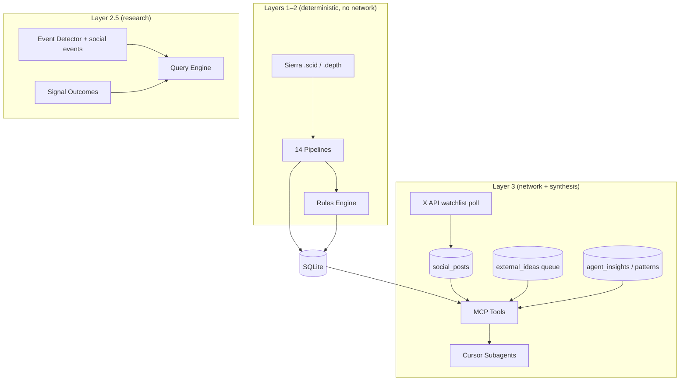
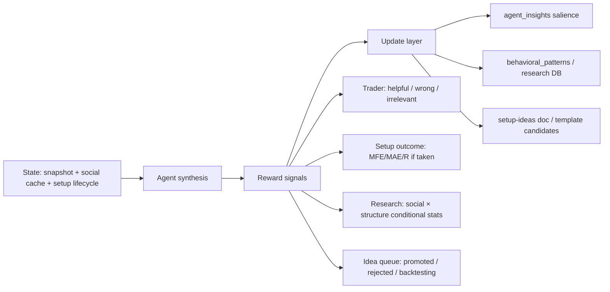

# Social Intelligence & Continual Learning — Roadmap

**Status:** Working feature track (exploration → phased delivery over weeks/months)
**Date:** 2026-06-30
**Owner context:** Trader wants trusted X accounts to inform confluence checks, surface backtesting hypotheses, provide real-time context from voices they respect, and prompt subagents with externally sourced edge situations — while The Desk stays data-based and architecturally sound.

**Related docs:**

| Doc | Role |
|-----|------|
| [social-confluence-design.md](social-confluence-design.md) | v1 implementation spec (Layer-3 cache + MCP tool) |
| [decision-log.md](decision-log.md) ADR-020 | Architectural decision (Pending) |
| [trader-memory/architecture.md](trader-memory/architecture.md) | Where validated learning lives |
| [setup-ideas-and-backtesting.md](setup-ideas-and-backtesting.md) IDEA-023 | Idea tracker entry |
| [AGENT.md](../AGENT.md) "Grounded Partnership" | Grounding doctrine for partner output |
| [X MCP docs](https://docs.x.com/tools/mcp) | External API + hosted MCP server |

---

## Vision (one paragraph)

The Desk already computes deterministic market structure and evaluates the trader's playbook. This feature track adds a **curated external intelligence layer**: posts and ideas from a short list of trusted X accounts, cached locally and compared against live structure, active setups, and research hypotheses. Subagents remain **data-based** — they do not "learn weights" from Twitter — but the **system** continually accumulates validated patterns: which external reads aligned with structure, which accounts correlate with the trader's outcomes, and which third-party setup ideas deserve backtest queue entries. External voices **prompt exploration**; market data and the trader's playbook **validate edge**.

---

## What this is NOT

| Misconception | Reality |
|---------------|---------|
| RL training subagent neural weights | Subagents are prompt frameworks + MCP routing; LLM weights live outside this repo |
| Twitter as a signal source | Social data is **context**, never a standalone alert (CLAUDE.md Rule #3) |
| Sentiment in Layer 1/2 pipelines | Pipelines and rules engine stay deterministic and network-free |
| Autonomous trade ideas from influencers | Third-party ideas enter a **hypothesis queue** for the trader to approve and backtest |
| Open-firehose "market sentiment" in v1 | Deferred — cost, noise, and Enterprise pricing (see ADR-020) |

---

## Three meanings of "training" (use precise language)

When discussing "training subagents with X data," distinguish:

### 1. Live context (Phase A — near term)

Pull recent posts from a curated watchlist at conversation or poll time. The agent compares external lean vs the trader's structure read and playbook state. **No persistence of learned behavior required** beyond cache.

### 2. System learning (Phase B–D — core long-term value)

Update **SQLite-backed memory and research priors**, not model weights:

- Log structured events when confluence is checked (social lean × structure × setup × trader action)
- Run conditional research: *when social alignment matched structure, what happened to my setups?*
- Promote trader-validated insights (`candidate` → `validated`) with sample-size gates
- Per-account calibration: early vs late, macro vs micro, narrative vs actionable

This is **human-in-the-loop contextual_information** — structurally similar to RL (state → synthesis → reward → update) but the "policy update" is insight salience and research statistics, not gradient descent.

### 3. Model training (Phase E+ — optional, low priority early)

Fine-tuned classifiers, embedding rankers, or RLHF on orchestrator phrasing. Possible later; marginal ROI vs Phases B–D for a discretionary trader. Highest risk of compliance blur if optimized to "agree with Twitter."

**Default recommendation:** invest in Phases A–D first.

---

## Architecture (mandatory layer separation)



**Hard rules (from CLAUDE.md — do not violate):**

1. Social/network code lives in isolated `src/social/` (or equivalent) — **Layer 3 only**
2. Social data **never fires a playbook alert** unless the trader explicitly adds a playbook rule referencing a stored social field
3. **No Claude API from Rust** — fetch + cache raw posts; synthesis at agent conversation time
4. **Background fetch only** — never block pipeline or MCP hot paths
5. **Feature-flagged** with graceful degradation when X API absent
6. **Compliance gate** on all coaching copy involving third-party opinions

---

## Use cases (why trusted accounts matter)

Trusted X accounts can contribute in **different ways**. The system should tag posts/ideas by intent, not treat all social text as generic "sentiment."

| Contribution type | Example | Desk behavior |
|-------------------|---------|---------------|
| **Real-time confluence** | "Acceptance above OR high" while you're watching OR5 | Compare to live structure; flag align/diverge |
| **Regime framing** | "Double distribution day developing" | Cross-check `day_type` pipeline; note agreement |
| **Level callout** | "Watching 21450 VWAP" | Proximity report vs current VWAP/levels |
| **Backtest hypothesis** | "Fade first IB extension when RVOL &lt; 30th pct" | Extract → **external idea queue** → IDEA entry → backtest |
| **Edge situation prompt** | "London sweep into RTH open often fails when…" | Subagent surfaces as **research candidate**, not alert |
| **Post-mortem / lesson** | "That FOMC rip was gamma-driven" | Memory category `regime_note` if trader validates |

**Key design choice:** multi-reason confluence requires **post classification metadata** (manual tags, agent-extracted tags, or trader-confirmed categories) stored alongside cached posts — not a single bull/bear score.

---

## Subagent model: data-based, externally prompted

Subagents (`orchestrator`, `orderflow-analyst`, `levels-analyst`, `backtest-analyst`, etc.) should:

1. **Ground every read in MCP tool output** (structure, outcomes, memory) — unchanged principle
2. **Receive external prompts as hypotheses**, not instructions — "Account X suggested Y; your data shows Z"
3. **Accumulate domain-scoped memory** over time — patterns *you* validated, not what the model "believes"

### Proposed specialist roles (future)

| Agent / framework | External intelligence role |
|-------------------|---------------------------|
| **Orchestrator** | Confluence summary: structure + playbook + watchlist lean; divergence flags |
| **levels-analyst** | Compare external level calls to proximity / IB extensions |
| **market-structure-analyst** | Compare external day-type / profile reads to TPO pipeline |
| **orderflow-analyst** | Compare delta/tape narratives to live microstructure |
| **backtest-analyst** | Ingest external setup ideas into hypothesis queue; run research when instrumented |
| **performance-analyst** | Longitudinal: social alignment × setup outcome for *your* trades |

### Continual learning loop (not RL)



**What updates:**

| Layer | Updates from social? | Mechanism |
|-------|---------------------|-----------|
| Pipelines (L1) | **Never** | — |
| Rules engine (L2) | **Only if trader adds explicit rule** | Playbook change |
| Research (L2.5) | **Yes** | Event logs + conditional queries |
| Memory (L3) | **Yes** | `save_agent_insight`, feedback, promotion |
| Agent `.md` prompts | **Deliberately** | Promote validated doctrine to `trader-memory/` |

The repo's **code** should not auto-mutate from tweets. **SQLite + curated markdown** carry learning.

---

## External idea ingestion pipeline

Third-party setup ideas and edge situations should flow through a **trader-gated queue**, mirroring how IDEA entries in `setup-ideas-and-backtesting.md` work.

### Conceptual flow

```
X post (or manual paste) 
  → extract structured hypothesis (agent-assisted, conversation time)
  → external_ideas table (status: candidate)
  → trader review: promote | dismiss | merge with existing IDEA
  → if promoted: IDEA-NNN entry + backtest instrumentation plan
  → backfill / research tools validate
  → if validated: setup_templates.rs candidate (trader decides)
```

### Extraction fields (draft schema)

| Field | Purpose |
|-------|---------|
| `source_handle` | Which account |
| `source_post_id` | Link back to cached post |
| `extracted_at_ms` | When captured |
| `hypothesis_summary` | One-line testable claim |
| `suggested_conditions` | Loose mapping to `ConditionField` candidates |
| `instrument_scope` | NQ / ES / etc. |
| `session_scope` | RTH / Globex / event-specific |
| `status` | `candidate` \| `promoted` \| `backtesting` \| `validated` \| `rejected` \| `dismissed` |
| `linked_idea_id` | e.g. `IDEA-023` or new IDEA number |
| `trader_notes` | Why promoted or rejected |

**Compliance:** Frame as *"Account X posted a testable idea; your backtest shows…"* — never *"Account X says take this trade."*

---

## Phased delivery

### Phase A — Account confluence (v1)

**Spec:** [social-confluence-design.md](social-confluence-design.md)

- Curated watchlist in `~/.the-desk/config.toml`
- Background poll → `social_posts` cache
- MCP tool `get_account_confluence` (structured posts + metadata)
- Orchestrator compares vs `get_market_snapshot` + active setup context
- Cost-controlled via cache (~$150–250/mo estimate for ~12 accounts)

**Open before build:** Bearer vs OAuth, watchlist, poll cadence, budget ceiling (ADR-020).

### Phase B — Event logging

When confluence is checked (automatically on setup check or on demand):

- Log `{ timestamp, watchlist_snapshot_id, structure_hash, setup_id, alignment_score, trader_action }`
- Enables longitudinal research without retroactive cherry-picking
- Pure Rust insert — no LLM in log path

### Phase C — Research conditionals

Extend query engine / research tools:

- `social_alignment` as a condition dimension (aligned | divergent | mixed | not_checked)
- Join with `signal_outcomes` and trader execution memory
- Sample-size policy unchanged: N&lt;20 insufficient, N≥30 reportable
- Example output: *"When 4+ watchlist accounts aligned bullish AND OR5 acceptance fired, median MFE was X (n=42)"*

### Phase D — Memory promotion

New insight categories:

- `social_confluence` — validated patterns about alignment vs your reads
- `account_calibration` — per-handle timing (early/late) and domain (macro/micro)
- `external_hypothesis` — promoted ideas and their backtest fate

Surface via `get_trader_context_fit` at `setupCheck` intent with existing budget caps.

### Phase E — RAG over social history (optional)

- Embeddings over cached posts for: *"Last time price was at VA high, what did watchlist say?"*
- Still Layer 3; retrieval augments agent context
- Review X content-storage ToS before long retention

### Phase F — Model training (optional, defer)

- Fine-tuned lean classifier, ranker, prompt RLHF
- Only if Phases B–D prove insufficient AND compliance review passes

---

## Confluence types (multi-reason design)

Not all confluence is "same direction." Explicitly model:

| Type | Definition | Agent framing |
|------|------------|---------------|
| **Directional** | Same bullish/bearish lean | "Aligned on direction" |
| **Structural** | Same levels referenced | "Both focused on IB high / VWAP" |
| **Regime** | Same day-type read | "Both calling balance / trend" |
| **Causal** | Different reason, same conclusion | "They cite gamma; your playbook cites OR5 — same side" |
| **Divergent** | Opposite lean or thesis | "Worth explicit check — deliberate fade?" |
| **Non-actionable** | Narrative / macro / off-session | Suppress from setup confluence; optional macro note |

---

## Integration with existing Desk systems

| System | Integration |
|--------|-------------|
| **Setup ideas doc** | Promoted external hypotheses → IDEA-NNN entries |
| **Research / backfill** | Validate external ideas same as internal ones |
| **Trader memory** | Validated social patterns → insights + doctrine |
| **Orchestrator** | New intent branch: confluence check on setup evaluation |
| **Risk coach** | Unchanged — social never affects sizing unless trader rule says so |
| **X MCP (Cursor-side)** | Can use hosted `https://api.x.com/mcp` via `xurl` during exploration; production path prefers Rust cache in Desk MCP for cost + consistency |

---

## Hard problems (decide early, revisit often)

1. **Ground truth** — tweets aren't labeled correct; only structure events + your outcomes are
2. **Lag** — posts often follow price; per-account calibration required
3. **Survivorship bias** — you follow accounts that recently worked; log at capture time
4. **Narrative vs structure** — X excels at stories; Desk excels at measurable structure
5. **Cost at scale** — cache is the lever; open firehose is Enterprise territory
6. **Compliance** — third-party opinion as context OK; as signal or sizing input is not
7. **ToS / retention** — how long to store posts; redistribution limits
8. **Idea overload** — queue discipline so subagents don't flood you with hypotheses

---

## Compliance checklist (before any live wiring)

- [ ] All social coaching uses third-party attribution ("Account X posted…")
- [ ] No alert fires solely because of social lean
- [ ] No "you should align with [influencer]" phrasing
- [ ] External ideas framed as hypotheses for **your** backtest
- [ ] Prompt review against `AGENT.md` "Grounded Partnership" (via prompt-quality-evaluator)
- [ ] Feature flag default off until trader enables

---

## Open questions (trader decisions)

1. **Watchlist** — handles, tiers (core vs occasional), account roles (early / confirmer / macro)
2. **Access mode** — read-only Bearer vs OAuth 2.0 (`xurl` bridge)
3. **Budget ceiling** — monthly X API spend cap
4. **Poll cadence** — RTH-only vs 24h; interval (15m / 30m / 60m)
5. **v1 scope** — confluence-only vs include curated-list sentiment score
6. **Idea extraction** — automatic on poll vs on-demand when you ask
7. **Which subagent owns external idea queue** — backtest-analyst vs orchestrator routing
8. **Auto-surface divergence** — always on setup check vs opt-in phrase

---

## Suggested next steps (when moving from exploration to build)

1. Mark ADR-020 **Decided** after watchlist + budget + access mode choices
2. Implement Phase A per [social-confluence-design.md](social-confluence-design.md)
3. Add orchestrator routing note for confluence checks (no new agent required initially)
4. Design `external_ideas` table + MCP tools in a follow-on ADR
5. Run 2–4 weeks of Phase A in shadow mode (log only, no coaching copy) to calibrate signal quality

---

## Changelog

| Date | Change |
|------|--------|
| 2026-06-30 | Initial roadmap from architecture exploration session; linked ADR-020 and v1 spec |
